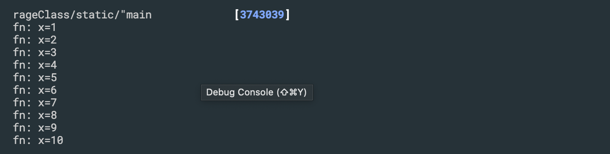
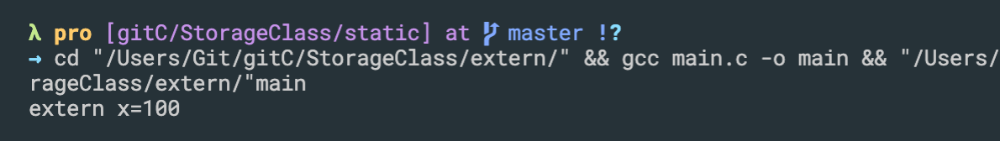

## auto extern static register
1. scope
2. life time
3. initial value


-
## static
```c++
#include<stdio.h>

void fn(){
    static int x = 0;
    x++;
    printf("fn: x=%d\n", x);
}

int main(){
    int i;
    for(i=0; i<10; i++){
        fn();
    }
    return 0;
}
```

---


## extern
```c++
#include<stdio.h>

int main(){
    extern int x; //这里声明使用的是外部全局变量
    printf("extern x=%d\n", x);
    return 0;
}

int x = 100;
```



