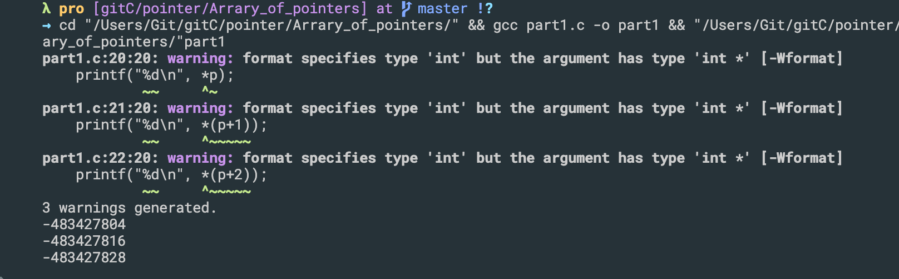
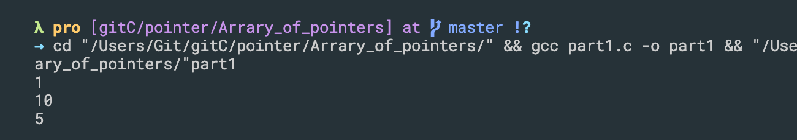
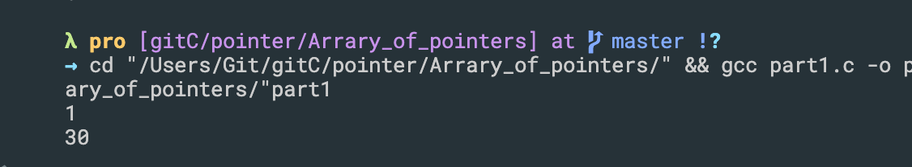
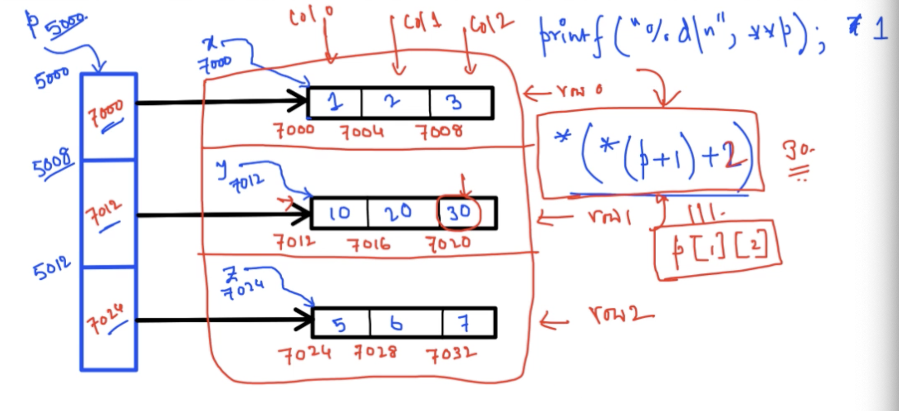
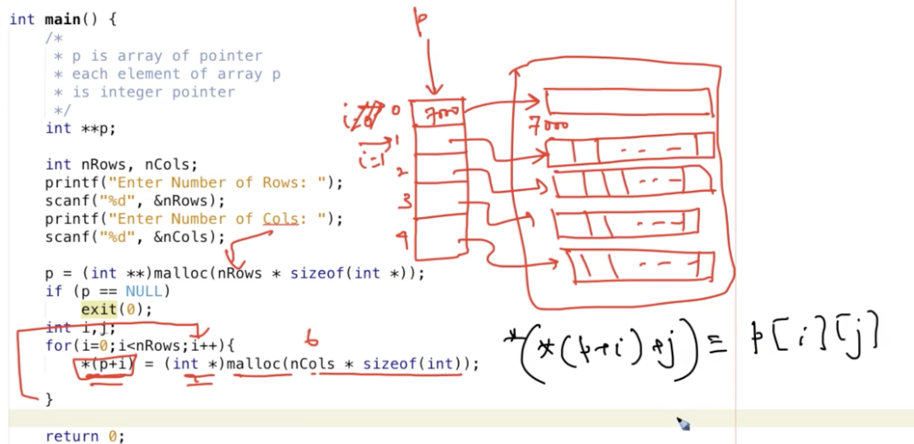
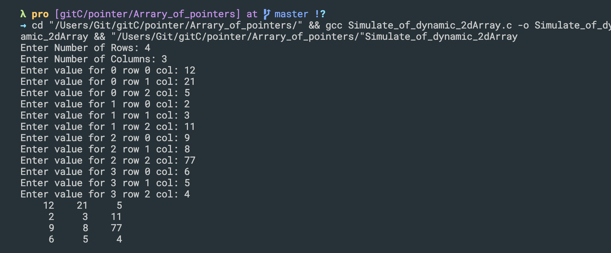

## Arrary of pointers - part1
- each element of array is pointer
- if i am using 64 bit operating system and size of each element is going to be 8 bytes


-
```c++
#include <stdio.h>
#include <stdlib.h> //malloc, calloc, realloc
int main()
{
    /**
     * p is array of pointer
     * each element of array p 
     * is integer pointer
    */
    int *p[3];
    int **k;
    int x[] = {1, 2, 3};
    int y[] = {10, 20, 30};
    int z[] = {5, 6, 7};

    p[0] = x;
    p[1] = y;
    p[2] = z;

    printf("%d\n", *p);
    printf("%d\n", *(p+1));
    printf("%d\n", *(p+2));
    return 0;
}
```

-
- note: `*p` is a pointer of array
- `**p` is the first element of this array
-

```c++
#include <stdio.h>
#include <stdlib.h> //malloc, calloc, realloc
int main()
{
    /**
     * p is array of pointer
     * each element of array p 
     * is integer pointer
    */
    int *p[3];
    int **k;
    int x[] = {1, 2, 3};
    int y[] = {10, 20, 30};
    int z[] = {5, 6, 7};

    p[0] = x;
    p[1] = y;
    p[2] = z;

    printf("%d\n", **p);
    printf("%d\n", **(p+1));
    printf("%d\n", **(p+2));
    return 0;
}
```

- every first elment of current array
```c++
int main()
{
    /**
     * p is array of pointer
     * each element of array p 
     * is integer pointer
    */
    int *p[3];
    int **k;
    int x[] = {1, 2, 3};
    int y[] = {10, 20, 30};
    int z[] = {5, 6, 7};

    p[0] = x;
    p[1] = y;
    p[2] = z;

    printf("%d\n", **p);
    printf("%d\n", *(*(p + 1) + 2)); //30
    return 0;
}
```


---


## Array of pointers-part2(Simulation of dynamic 2D array)

```c++
#include <stdio.h>
#include <stdlib.h>

int **allocate(int nRows, int nCols)
{
    int **p;
    p = (int **)malloc(nRows * sizeof(int *));
    if (p == NULL)
    {
        exit(0);
    }
    int i, j;
    for (i = 0; i < nRows; i++)
    {
        *(p + i) = (int *)malloc(nCols * sizeof(int));
    }
    return p;
}

void inputValues(int **p, int nRows, int nCols){
    int i, j;
    for(i=0; i<nRows; i++){
        for(j=0; j<nCols; j++){
            printf("Enter value for %d row %d col: ", i, j);
            // scanf("%d", &p[i][j]);
            scanf("%d", (*(p+i)+j) );
        }
    }
}

void printValues(int **p, int nRows, int nCols){
    int i, j;
    for(i=0; i<nRows; i++){
        for(int j=0; j<nCols; j++){
            // printf("%6d", p[i][j]);
            printf("%6d", *(*(p+i)+j));
        }
        printf("\n");
    }
}

int main()
{
    /**
     * p is array of pointer
     * each element of array p 
     * is integer pointer
    */
    int **p;

    int nRows, nCols;
    printf("Enter Number of Rows: ");
    scanf("%d", &nRows);
    printf("Enter Number of Columns: ");
    scanf("%d", &nCols);
    p = allocate(nRows, nCols);
    inputValues(p, nRows, nCols);
    printValues(p, nRows, nCols);
    // deallocate(p, nRows, nCols);
    free(p);

    return 0;
}
```

---
