## Conception of stack and heap memonry


## introduction to pointers
```c++
//Callback Abstraction, modularization
const request = require('request');
const geocode = require('./utils/geocode');

geocode('Boston', (error, data) => {
    console.log('Error', error);
    console.log('Data', data);
})
```
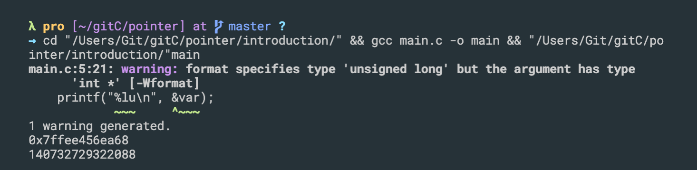
- update
```c++
#include<stdio.h>
int main(){
    int var = 5;

    int *p; 
    // float *k;
    // double *d;

    printf("%p\n", &var);
    p = &var;

    *p = 10;
    printf("%d\n", var);


    // printf("%lu\n", &var);
    return 0;
}
```

---


## introduction pointer
- pointer, point to pointer
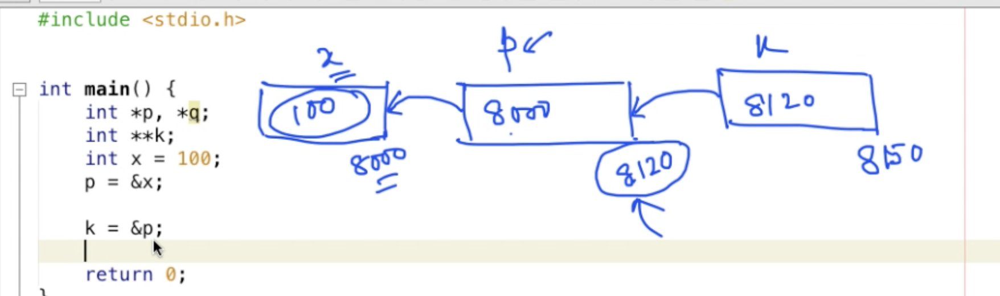
```c++
#include<stdio.h>
int main(){
    int *p, *q; 
    int **k; //pointer, point to pointer
    int x = 100;

    p = &x;
    k = &p;

    printf("(**k)=%d\n", **k);

    **k = **k + 1;
    printf("x=%d\n", x);
    return 0;
}
```
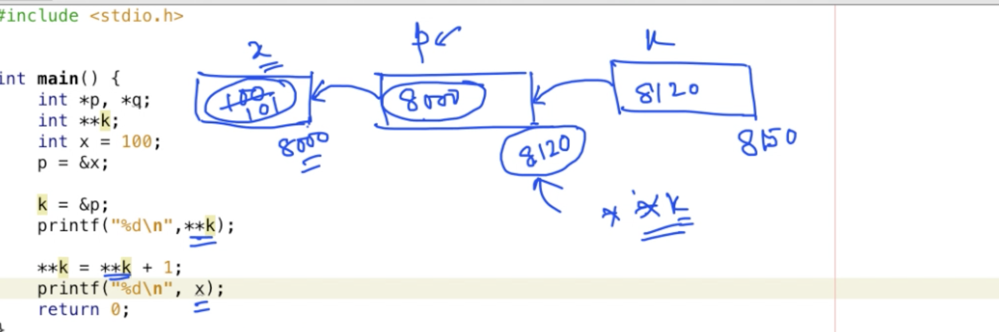

---


## introduction
```c++
#include<stdio.h>
int main(){
    int *p;
    float *f;
    double *d;

    printf("%lu %lu %lu\n", sizeof(p), sizeof(f), sizeof(d));
    return 0;
}
```
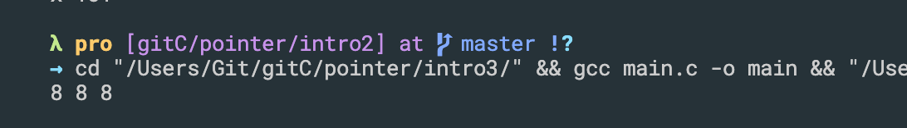
- The size of the pointer basically depends on the architecture of the system in which it is implemented. For example the size of a pointer in 32 bit is 4 bytes (32 bit ) and 8 bytes(64 bit ) in a 64 bit machines. The bit types in a machine are nothing but memory address, that it can hold. 32 bit machines can hold `2^32` and 64 bit machines can hold `2^64` address spaces. So a pointer (variable which points to a memory location) should be able to point to any of the memory address (`2^32 for 32 bit and 2^64 for 64 bit`) that a machines holds.

- Because of this reason we see the size of a pointer to be 4 bytes in 32 bit machine and 8 bytes in a 64 bit machine.

-
- update
```c++
#include<stdio.h>
int main(){
    int *p;
    float *f;
    double *d;

    printf("%lu %lu %lu\n", sizeof(p), sizeof(f), sizeof(d));
    printf("%lu %lu %lu\n", sizeof(*p), sizeof(*f), sizeof(*d));
    return 0;
}
```
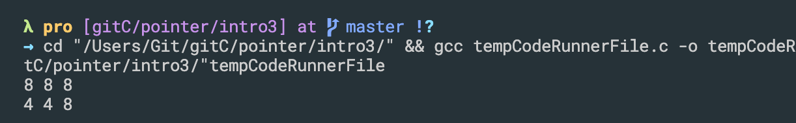
-
- update
```c++
#include<stdio.h>
int main(){
    int *p;
    float *f;
    double *d;
    char *k;

    printf("%lu %lu %lu %lu\n", sizeof(p), sizeof(f), sizeof(d), sizeof(k));
    printf("%lu %lu %lu %lu\n", sizeof(*p), sizeof(*f), sizeof(*d), sizeof(*k));
    return 0;
}
```
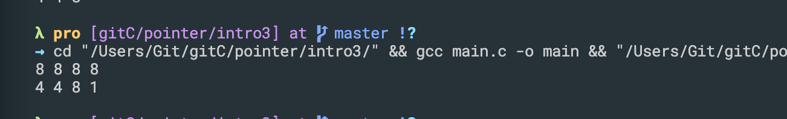
---


## Address arithmetic
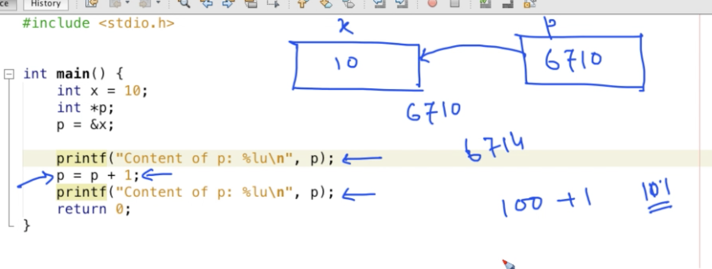
- when we talk about the address, 6710, + 1, is at x 4 bytes in the memory, so 6711 cannot be the address of any other intercept because it's been occupied here
```c++
#include<stdio.h>
int main(){
    int x = 10;
    int *p;
    p = &x;

    printf("Content of p: %lu\n", p);

    p = p+1;
    printf("Content of p: %lu\n", p);
    
    return 0;
}
```
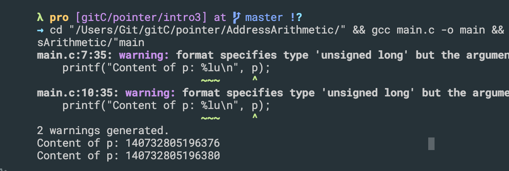
- 6376 + 4 = 6380
---


## More on pointer


## How and when to use pointer in C program
- look at an example
```c++
#include <stdio.h>

void swap(int a, int b)
{
    int temp;
    temp = a;
    a = b;
    b = temp;
}

int main()
{
    int x = 100, y = 200;

    printf("x = %d, y = %d\n", x, y);
    swap(x , y);
    printf("x = %d, y = %d\n", x, y);

    return 0;
}
```
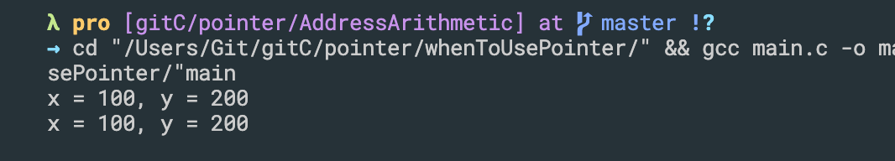
- a, b exchange the value, but x, y still didn't change
- because x, y are out of function
- we can use pointer
```c++
#include <stdio.h>

void swap(int *a, int *b)
{
    int temp;
    temp = *a;
    *a = *b;
    *b = temp;
}

int main()
{
    int x = 100, y = 200;

    printf("x = %d, y = %d\n", x, y);
    swap(&x , &y);
    printf("x = %d, y = %d\n", x, y);

    return 0;
}
```
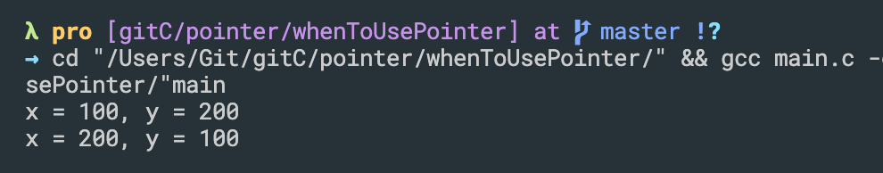
---


## More programming example


## Relationship between one dimensional array and pointer
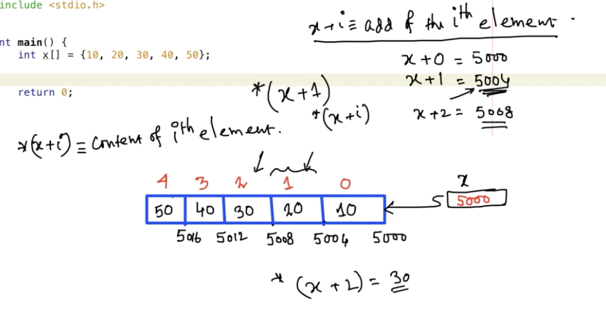
```c++
#include<stdio.h>
int main(){
    int x[] = {10, 20, 30, 40, 50};

    printf("%p, %p\n", x, &x[0]);
    return 0;
}
```
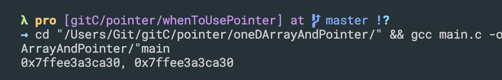

-
```c++
#include <stdio.h>

int main()
{
    int x[] = {10, 20, 30, 40, 50};

    printf("%p, %p\n", x, &x[0]);

    int i = 0;
    printf("\nContent of the array is: \n");
    for (i = 0; i < 5; i++)
    {
        printf("%4d ", *(x + i));
    }
    printf("\n");

    return 0;
}
```
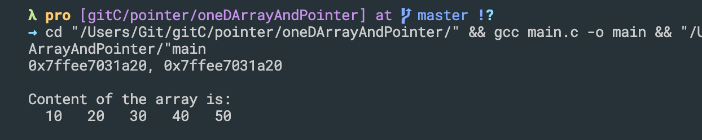
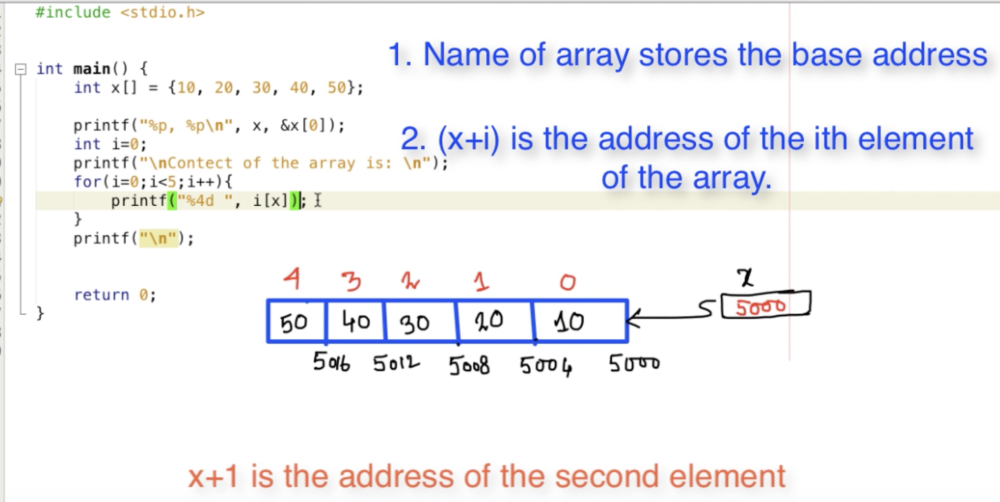
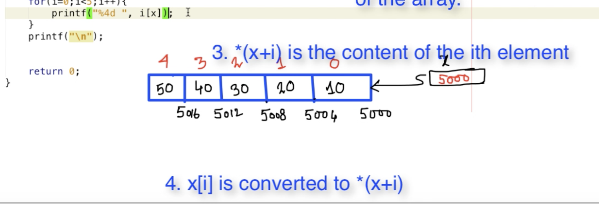
---

## Passing one dimensional array to function

```c++
#include<stdio.h>

void printArray(int *p_arr, int n){
    int i;
    printf("Content of array: ");
    for(i=0; i<n; i++){
        printf("%4d", *(p_arr + i));
    }
    printf("\n");
}

int main(){
    int x[] ={10, 20, 30, 40, 50};
    int y[] ={1, 2, 3, 4, 5, 6};
    printArray(x, 5);
    printArray(y, 6);
    return 0;
}
```
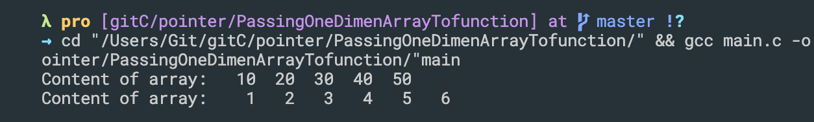
---

## more example on passing one dimensional array to function
```c++
#include <stdio.h>

void toggleChar(char *ptr)
{
    int i;
    for (i = 0; *(ptr + i) != '\0'; i++)
    {
        if (*(ptr + i) >= 'A' && *(ptr + i) <= 'Z')
        {
            *(ptr + i) = *(ptr + i) + 32;
        }else if(*(ptr + i) >= 'a' && *(ptr + i) <= 'z'){
            *(ptr + i) = *(ptr + i) - 32;
        }
    }
}

int main()
{
    char str[100];

    printf("Enter a string: ");
    scanf("%[^\n]", str);

    toggleChar(str);
    printf("Toggled characters : %s\n", str);
    return 0;
}
```
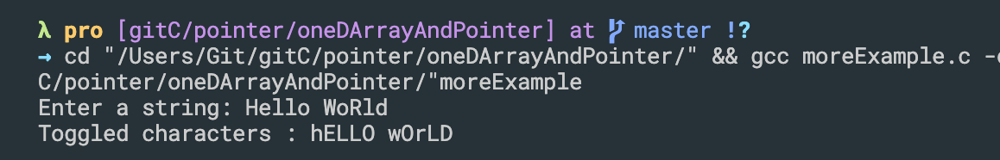
---


## Clony with 8 cells - simulation


## One more example - Passing a string to a function
```c++
#include <stdio.h>
#include <stdlib.h>
#define MAX 30
/**
 * Write a function split that receives a string like "book*abacus" and splits it into two strings,
 * first and last. The first contains all the characters prior to that * and last contains all the 
 * characters after that *.
 * We can assume that there is only one * there.
 * 
 * prior to (在...之前)
*/

void split(char str[], char first[], char second[]){
    int i = 0;
    int j = 0;
    while(str[i] != '*'){
        first[j] = str[i];
        i++; j++;
    }
    first[j] = '\0'; //first terminate
    i = i+1;
    j = 0;
    while(str[i] != '\0'){
        second[j] = str[i];
        i++; j++;
    }
    second[j] = '\0';
}

int main(){
    char str[] = "book*abacus";
    char first[MAX];
    char second[MAX];
    split(str, first, second);
    printf("First Part: %s\n", first);
    printf("Second Part: %s\n", second);

    return 0;
}
```
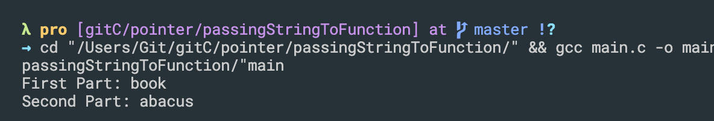
---


