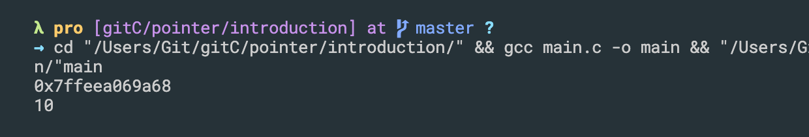
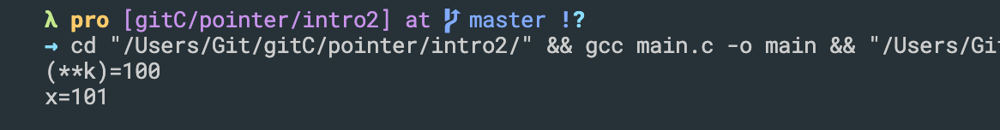

## Conception of stack and heap memonry


## introduction to pointers
```c++
//Callback Abstraction, modularization
const request = require('request');
const geocode = require('./utils/geocode');

geocode('Boston', (error, data) => {
    console.log('Error', error);
    console.log('Data', data);
})
```

- update
```c++
#include<stdio.h>
int main(){
    int var = 5;

    int *p; 
    // float *k;
    // double *d;

    printf("%p\n", &var);
    p = &var;

    *p = 10;
    printf("%d\n", var);


    // printf("%lu\n", &var);
    return 0;
}
```

---


## introduction pointer
- pointer, point to pointer

```c++
#include<stdio.h>
int main(){
    int *p, *q; 
    int **k; //pointer, point to pointer
    int x = 100;

    p = &x;
    k = &p;

    printf("(**k)=%d\n", **k);

    **k = **k + 1;
    printf("x=%d\n", x);
    return 0;
}
```


---


## introduction
```c++
#include<stdio.h>
int main(){
    int *p;
    float *f;
    double *d;

    printf("%lu %lu %lu\n", sizeof(p), sizeof(f), sizeof(d));
    return 0;
}
```

- The size of the pointer basically depends on the architecture of the system in which it is implemented. For example the size of a pointer in 32 bit is 4 bytes (32 bit ) and 8 bytes(64 bit ) in a 64 bit machines. The bit types in a machine are nothing but memory address, that it can hold. 32 bit machines can hold `2^32` and 64 bit machines can hold `2^64` address spaces. So a pointer (variable which points to a memory location) should be able to point to any of the memory address (`2^32 for 32 bit and 2^64 for 64 bit`) that a machines holds.

- Because of this reason we see the size of a pointer to be 4 bytes in 32 bit machine and 8 bytes in a 64 bit machine.

-
- update
```c++
#include<stdio.h>
int main(){
    int *p;
    float *f;
    double *d;

    printf("%lu %lu %lu\n", sizeof(p), sizeof(f), sizeof(d));
    printf("%lu %lu %lu\n", sizeof(*p), sizeof(*f), sizeof(*d));
    return 0;
}
```

-
- update
```c++
#include<stdio.h>
int main(){
    int *p;
    float *f;
    double *d;
    char *k;

    printf("%lu %lu %lu %lu\n", sizeof(p), sizeof(f), sizeof(d), sizeof(k));
    printf("%lu %lu %lu %lu\n", sizeof(*p), sizeof(*f), sizeof(*d), sizeof(*k));
    return 0;
}
```

---


## Address arithmetic
```c++

```


```c++
```
```c++
```

```c++
```

```c++
```

