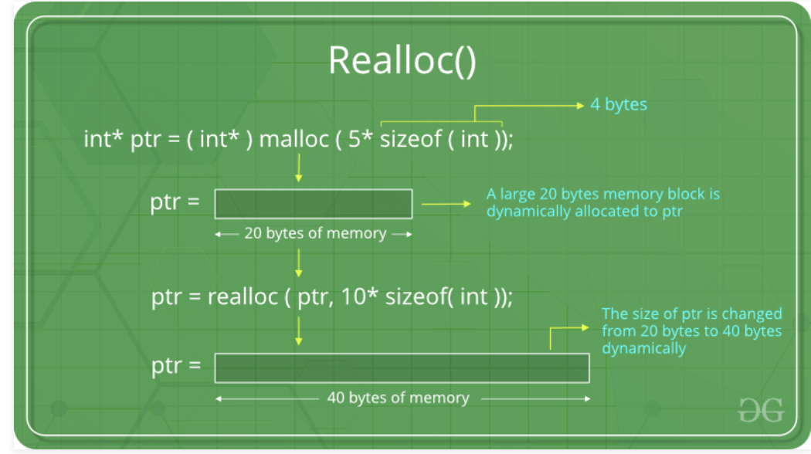

## use of const keyword with pointer
```c++
#include<stdio.h>

int main(){
    const double PI = 3.14;
    int x[] = {1, 2, 3};
    // int *p;
    int * const p;

    p = x;
    p++;
    return 0;
}
```

---

-
- if we need to assign some value to the const point 
- update

```c++
#include<stdio.h>

int main(){
    const double PI = 3.14;
    int x[] = {1, 2, 3};
    int * const p = x;

    p++; //this is illegal
    (*p)++; //this is legal
    return 0;
}
```
-

```c++
#include<stdio.h>

int main(){
    const double PI = 3.14;
    int x[] = {1, 2, 3};
    int * const p = x;

    printf("%d \n", *p);
    return 0;
}
```

---
-
```c++
#include<stdio.h>

int main(){
    const double PI = 3.14;
    int x[] = {1, 2, 3};
    const int *p = x;

    p++; //this is legal
    (*p)++; //this is illegal
    return 0;
}
```
---

## Add some more glue


## The generic pointer is void pointer
- A void pointer is a pointer that has no associated data type with it. A void pointer can hold address of any type and can be typcasted to any type.
```c++
#include<stdio.h>
int main(){
    void *vp;
    int x = 100;
    vp = &x;

    printf("%d\n", *vp);
    return 0;
}
```

- this is illegal, since the generic pointer is not associate with digit type.
- so we need to cast to int type
```c++
#include<stdio.h>
int main(){
    void *vp;
    int x = 100;
    vp = &x;

    printf("%d\n", *((int *)vp));
    return 0;
}
```

---


## Dynamic memory allocation malloc function
- Syntax: `ptr = (cast-type*) malloc(byte-size)`
- “malloc” or “memory allocation” method in C is used to dynamically allocate a single large block of memory with the specified size. It returns a pointer of type void which can be cast into a pointer of any form.
```c++
#include<stdio.h>
#include<stdlib.h> //malloc, calloc, realloc
int main(){
    int *p;
    int n;
    printf("Enter how many integers: ");
    scanf("%d", &n);
    // p = (int *)malloc(100);
    p = (int *)malloc(n * sizeof(int));
    //since malloc return a void pointer, so it neet to be cast to int
    if(p == NULL){
        printf("Unable to allocate memory\n Exiting the program\n");
        exit(1); //if exit(0), then the calling environment will understand that it's a normal exit.
        //exit(1), passing 1, means there are some bad situation
    }

    //use the allocate space pointed by p for keeping values
    int i;
    for(i=0; i<n; i++){
        printf("Next Number: ");
        scanf("%d", p+i);
    }
    printf("Content of the array: ");
    for(i = 0; i<n; i++){
        printf("%4d", *(p+i));
    }
    printf("\n");


    return 0;
}
```

---

## Dynamic memory allocation - calloc function
- **“calloc”** method in C is used to dynamically allocate the specified number of blocks of memory of the specified type. It initializes each block with a default value ‘0’.
- Syntax: `ptr = (cast-type*)calloc(n, element-size);`
```c++
#include<stdio.h>
#include<stdlib.h> //malloc, calloc, realloc
int main(){
    int *p;
    int n;
    printf("Enter how many integers: ");
    scanf("%d", &n);

    p = (int *)calloc(n, sizeof(int));
    if(p == NULL){
        printf("Unable to allocate memory\n Exiting the program\n");
        exit(1); //if exit(0), then the calling environment will understand that it's a normal exit.
        //exit(1), passing 1, means there are some bad situation
    }
    
    int i;
    for(i=0; i<n; i++){
        printf("Next Number: ");
        scanf("%d", p+i);
    }
    printf("Content of the array: ");
    for(i = 0; i<n; i++){
        printf("%4d", *(p+i));
    }
    printf("\n");


    return 0;
}
```

---


## Dynamic memory allocation - realloc function

- Syntax `ptr = realloc(ptr, newSize);`
- where ptr is reallocated with new size 'newSize'.
```c++
#include <stdio.h>
#include <stdlib.h> //malloc, calloc, realloc
int main()
{
    int *p;
    int n;
    printf("Enter how many integers: ");
    scanf("%d", &n);

    p = (int *)calloc(n, sizeof(int));
    if (p == NULL)
    {
        printf("Unable to allocate memory\n Exiting the program\n");
        exit(1);
    }

    int i;
    for (i = 0; i < n; i++)
    {
        printf("Next Number: ");
        scanf("%d", p + i);
    }
    printf("Content of the array: ");
    for (i = 0; i < n; i++)
    {
        printf("%4d", *(p + i));
    }
    printf("\n");

    int new_num = n + 3;
    p = (int *)realloc(p, new_num * sizeof(int));
    if (p == NULL)
    {
        printf("Unable to allocate memory\n Exiting the program\n");
        exit(1);
    }

    *(p + n) = 10;
    *(p + n + 1) = 20;
    *(p + n + 2) = 30;
    free(p);

    printf("New Content of the array: \n");
    for (i = 0; i < new_num; i++)
    {
        printf("%4d", *(p + i));
    }
    printf("\n");
    return 0;
}
```

---


## Immutable property of string literals
- we cannot change the contents of any elment of this at it.
- That means this string which is a constant string is immutable
- that means the content of this sting is final
```c++
#include <stdio.h>
#include <stdlib.h> //malloc, calloc, realloc
int main(){
    char *str = "Hello";
    printf("%s\n", str);

    *(str+1)='o';
    printf("%s\n", str);
    return 0;
}
```

---

## Arrary of pointers - part1
- each element of array is pointer
- if i am using 64 bit operating system and size of each element is going to be 8 bytes


```c++
```

```c++
```

```c++
```

```c++
```
```c++
```

```c++
```

```c++
```

```c++
```