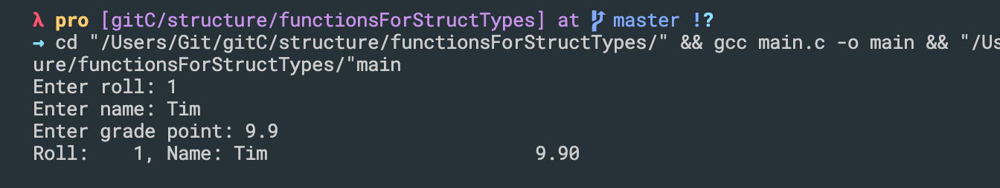
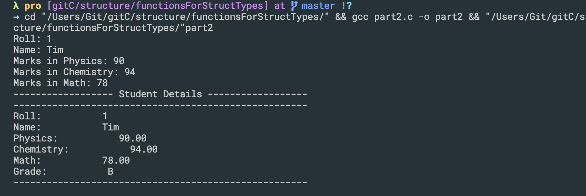
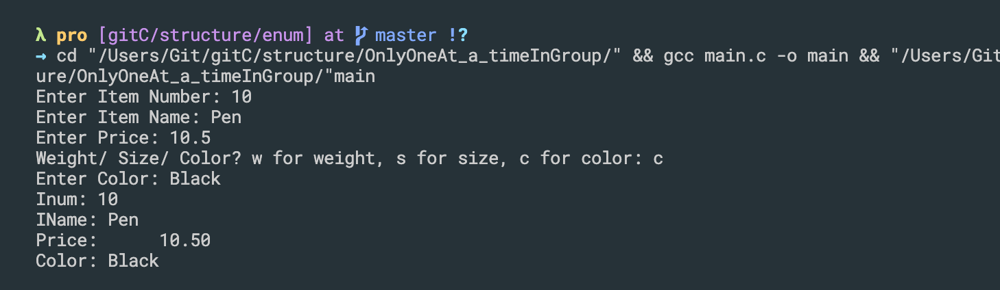

## struct keyword
```c++
#include<stdio.h>

struct Student{
    int roll;
    char name[20];
    double gp;
};

int main(){
    struct Student s1, s2, s3;
    s1.roll = 5;
    s2.roll = 10;
    s1.gp = 9.6;
    return 0;
}
```
---

## typedef keyword, creating alias to type
```c++
#include<stdio.h>

struct Student{
    int roll;
    char name[20];
    double gp;
};

typedef int integer;
typedef struct Student Student; //creating alias for `struct Student`

int main(){
    integer x;

    // struct Student s1, s2, s3;
    Student s1, s2, s3;
    s1.roll = 5;
    s2.roll = 10;
    s1.gp = 9.6;
    return 0;
}
```

-
- 2nd way

```c++
//2nd way
#include<stdio.h>

typedef struct{
    int roll;
    char name[20];
    double gp;
} Student;

typedef int integer;
// typedef struct Student Student; //creating alias for `struct Student`

int main(){
    integer x;

    // struct Student s1, s2, s3;
    Student s1, s2, s3;
    s1.roll = 5;
    s2.roll = 10;
    s1.gp = 9.6;
    return 0;
}
```
---


## pointer to struct object
```c++
//pointer to struct object
#include<stdio.h>

typedef struct{
    int roll;
    char name[20];
    double gp;
} Student;


int main(){
    Student s;
    Student *sp;

    sp = &s;

    (*sp).roll = 15;
    printf("%d\n", (*sp).roll);

    sp->roll = 17;
    scanf("%[^\n]", sp->name);
    return 0;
}
```
---

## Writing behavior (functions) for struct types -part1
```c++
#include<stdio.h>

typedef struct{
    int roll;
    char name[20];
    double gp;
} Student;

void inputStudent(Student *sp){
    printf("Enter roll: ");
    scanf("%d", &(sp->roll));
    printf("Enter name: ");
    scanf(" %[^\n]", sp->name);
    printf("Enter grade point: ");
    scanf("%lf", &(sp->gp));
}

void printStudent(Student sp){
    printf("Roll: %4d, Name: %-20s %10.2lf\n", sp.roll, sp.name, sp.gp);
}

int main(){
    Student s;
    inputStudent(&s);
    printStudent(s);

    return 0;
}
```

---

## Writing behavior (functions) for struct types -part2
```c++
```



```c++
#include<stdio.h>

typedef struct{
    int roll;
    char name[20];
    double phy, chem, maths;
} Student;

void inputStudent(Student *);
char getGrade(Student);
void printStudent(Student);
double getAverageMarks(Student);

void inputStudent(Student *sp){
    printf("Roll: ");
    scanf("%d", &(sp->roll));
    printf("Name: ");
    scanf(" %[^\n]", sp->name);
    printf("Marks in Physics: ");
    scanf("%lf", &(sp->phy));
    printf("Marks in Chemistry: ");
    scanf("%lf", &(sp->chem));
    printf("Marks in Math: ");
    scanf("%lf", &(sp->maths));
}

double getAverageMarks(Student s){
    double sum = 0.0;
    sum = s.phy + s.chem + s.maths;
    return sum / 3.0;
}

char getGrade(Student s){
    char grade;
    double avg = getAverageMarks(s);

    if(avg >= 90){
        grade = 'A';
    }else if(avg >= 80 && avg < 90){
        grade = 'B';
    }else if(avg >= 70 && avg < 80){
        grade = 'C';
    }else if(avg >= 60 && avg < 70){
        grade = 'D';
    }else if(avg >= 50 && avg < 60){
        grade = 'E';
    }else{
        grade = 'F';
    }

    return grade;
}

void printStudent(Student s){
    printf("------------------ Student Details ------------------\n");
    printf("-----------------------------------------------------\n");
    printf("Roll:           %-4d\n", s.roll);
    printf("Name:           %-20s\n", s.name);
    printf("Physics:           %-10.2lf\n", s.phy);
    printf("Chemistry:           %-10.2lf\n", s.chem);
    printf("Math:           %-10.2lf\n", s.maths);
    printf("Grade:           %-4c\n", getGrade(s));
    printf("-----------------------------------------------------\n");
}


int main(){
    Student s;
    inputStudent(&s);
    printStudent(s);

    return 0;
}
```
---


## declaring enumerated constants, enum keyword

```c++
#include<stdio.h>
typedef enum{
    SUN, MON, TUES, WED, THURS, FRI, SAT
}days_of_week;

typedef enum{
    FALSE, TRUE
}Boolean;

Boolean isEven(int n){
    if(n % 2 == 0){
        return TRUE;
    }else{
        return FALSE;
    }
}

int main(){
    days_of_week day = SAT;

    if(day == SAT || day == SUN){
        printf("Holiday\n");
    }else{
        printf("Not holiday\n");
    }
    printf("Value of SUN is: %d\n", SUN);
    return 0;
}
```
---

## Only one at a time in group, use of enum keyword 
```c++
#include <stdio.h>

typedef union {
    double weight;
    int size;
    char color[10];
}Description;

typedef struct
{
    int ino;
    char iname[30];
    Description d;
    char dtype;
    double price;
} Item;

void inputItem(Item *ip){
    printf("Enter Item Number: ");
    scanf("%d", &(ip->ino));
    printf("Enter Item Name: ");
    scanf(" %s", ip->iname);
    printf("Enter Price: ");
    scanf("%lf", &(ip->price));

    printf("Weight/ Size/ Color? w for weight, s for size, c for color: ");
    scanf(" %c", &(ip->dtype));

    if(ip->dtype == 's'){
        printf("Enter Size: ");
        scanf("%d", &(ip->d.size));
    }else if(ip->dtype == 'c'){
        printf("Enter Color: ");
        scanf(" %s", ip->d.color);
    }else if(ip->dtype == 'w'){
        printf("Enter weight: ");
        scanf("%lf", &(ip->d.weight));
    }
}

void printItem(Item item){
    printf("Inum: %d\n", item.ino);
    printf("IName: %s\n", item.iname);
    printf("Price: %10.2lf\n", item.price);

    if(item.dtype == 's'){
        printf("Size: %d\n", item.d.size);
    }else if(item.dtype == 'c'){
        printf("Color: %s\n", item.d.color);
    }else if(item.dtype == 'w'){
        printf("weight: %10.2lf\n", item.d.weight);
    }
    printf("\n");
}


int main()
{
    Item item;
    inputItem(&item);
    printItem(item);
    return 0;
}
```


