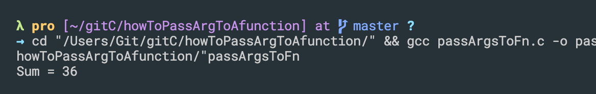
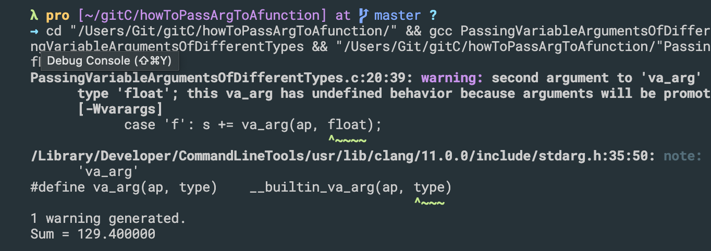

## How to pass variable arguments to function
```c++
//How to pass variable arguments to function
#include<stdio.h>
#include<stdarg.h>

int sum(int count, ...){
    int s = 0;
    va_list ap;
    va_start(ap, count);

    int i;
    for(i=1; i<=count; i++){
        s += va_arg(ap, int);

    }
    va_end(ap);
    return s;
}

int main(){
    int k = sum(4, 20, 10, 4, 2);
    printf("Sum = %d\n", k);

    return 0;
}
```

---

## Passing variable arguments of different types
```c++
#include<stdio.h>
#include<stdarg.h>
#include<string.h>
#include<stdlib.h>

double sum(char *format, ...){
    double s = 0.0;
    va_list ap;
    va_start(ap, format);

    int i;
    for(i=0; i<strlen(format); i++){
        char ch = format[i];
        switch (ch)
        {
            case 'i': s += va_arg(ap, int);
                break;
            case 'd': s += va_arg(ap, double);
                break;
            case 'f': s += va_arg(ap, float);
                break;
        
            default: printf("Invalid format found");
                exit(1);
        }
    }
    va_end(ap);
    return s;
}

int main(){
    double k = sum("idfid", 20, 10.5, 4.2f, 90, 10.9);
    printf("Sum = %lf\n", k);

    return 0;
}
```


