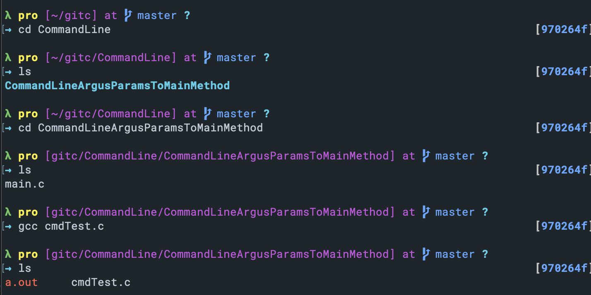
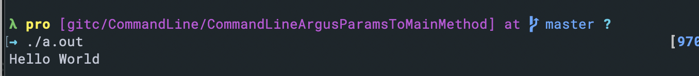
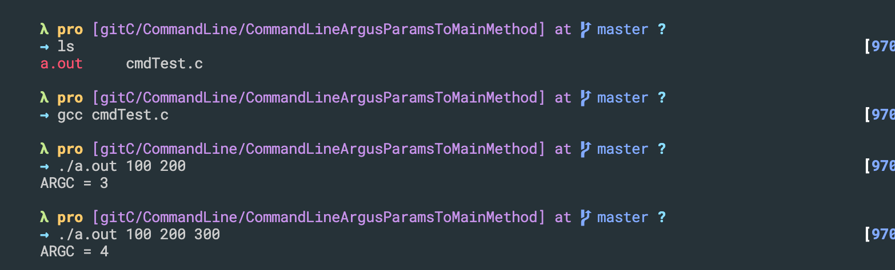
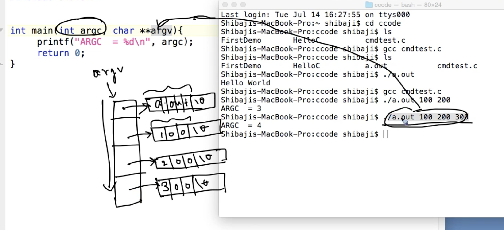
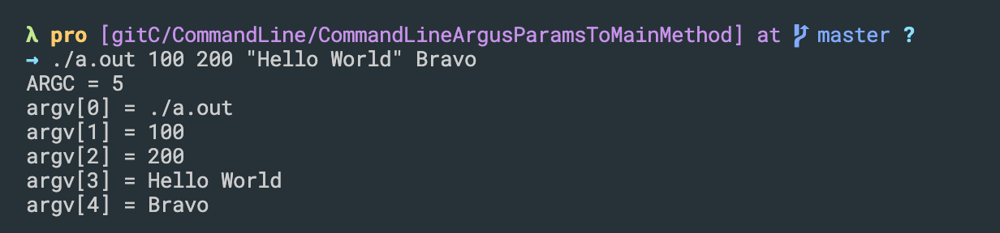
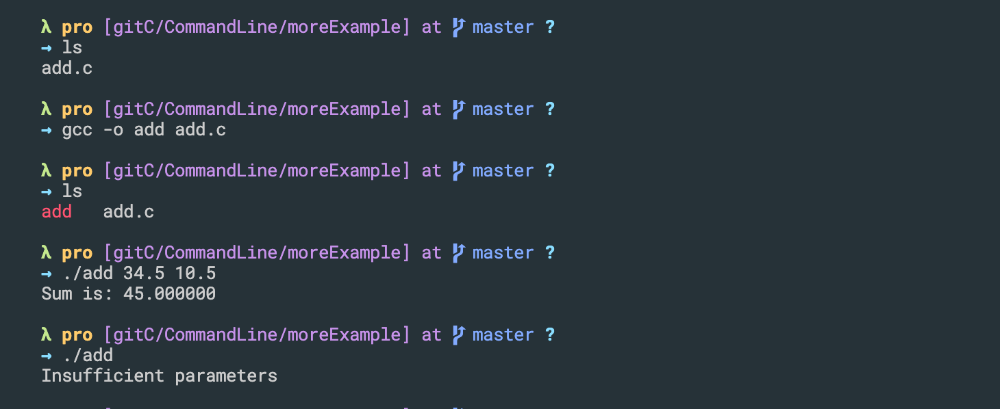
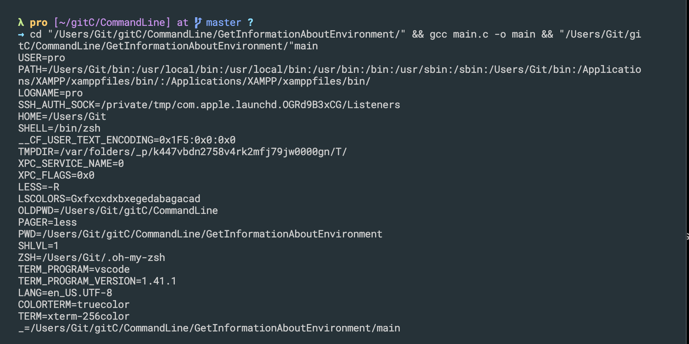

## Command line arguments, parameters to main method
- cmdTest.c
```c++
#include<stdio.h>
int main(){
    printf("Hello World\n");
    return 0;
}
```


---

- update
```c++
#include<stdio.h>

int main(int argc, char **argv){
    printf("ARGC = %d\n", argc);
    return 0;
}
```

- There are the three parameters and the name of the object file `a.out` is passed also as the first parameter, 100 to be 2nd, 200 to 3rd, 300 to 4th, totally 4

- update
```c++
#include<stdio.h>

int main(int argc, char **argv){
    printf("ARGC = %d\n", argc);
    int i;
    for(i=0; i<argc; i++){
        printf("argv[%d] = %s\n", i, argv[i]);
    }
    return 0;
}
```
 
- Note: `"Hello World"`, there is space btw Hello and World, thus it need " "
---


## Command line arguments - more example
```c++
#include<stdio.h>
#include<stdlib.h> //atof, atoi

int main(int argc, char **argv){
    if(argc == 1){
        printf("Insufficient parameters\n");
        return 0;
    }

    double sum = 0.0;

    int i;
    for(i = 1; i < argc; i++){
        sum = sum + atof(argv[i]);  
        //the purpose of atof is to convert a string to floating pointer or a real number
    }
    printf("Sum is: %lf\n", sum);

    return 0;
}
```

---

## Passing cmd line args in Netbeans

## Get information about environment, the environmental parameter in main
- create a main.c
```c++
#include<stdio.h>

int main(int argc, char **argv, char **envp){

    int i;
    for(i = 0; envp[i]!='\0'; i++){
        printf("%s\n", envp[i]);
    }

    return 0;
}
```


