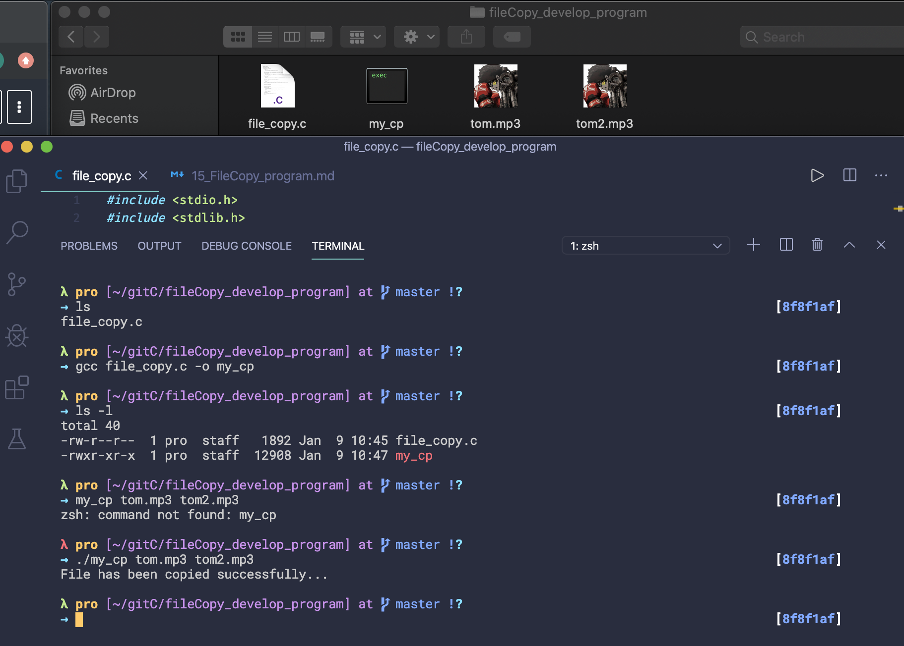

## Develop the file copy program step by step

- first
```c++
int main(int argc, char *argv[]){

    return 0;
}
```
- all the data we just had received here from `*argv[]`, and the Count parameters that has received here from `argc`
-
-
- update
```c++
#include<stdio.h>
#include<stdlib.h>

int main(int argc, char *argv[]){
    if(argc != 3){
        printf("Invalid number of parameters, must be 3\n");
        exit(0);
    }
    FILE *source, *dest;
    source = fopen(argv[1], "rb"); //read binary mode, since we want to read any file including binary or text file
    //it'll be able to copy image files video files all the files
    if(source == NULL){
        printf("Unable to open file %s, make sure that the file exists\n", argv[1]);
        exit(0);
    }
    dest = fopen(argv[2], "wb");
    if(dest == NULL){
        printf("Unable to create file %s for writing, make sure that you have permission to write\n", argv[2]);
        exit(0);
    }
    return 0;
}
```
- the idea is :

---


-
- update final version
```c++
#include <stdio.h>
#include <stdlib.h>

#define BLOCK_SIZE 4096

int main(int argc, char *argv[])
{
    if (argc != 3)
    {
        printf("Invalid number of parameters, must be 3\n");
        exit(0);
    }
    FILE *source, *dest;
    source = fopen(argv[1], "rb"); //read binary mode, since we want to read any file including binary or text file
    //it'll be able to copy image files video files all the files
    if (source == NULL)
    {
        printf("Unable to open file %s, make sure that the file exists\n", argv[1]);
        exit(0);
    }
    dest = fopen(argv[2], "wb");
    if (dest == NULL)
    {
        printf("Unable to create file %s for writing, make sure that you have permission to write\n", argv[2]);
        exit(0);
    }

    // ----
    char *buffer = (char *)malloc(sizeof(double) * BLOCK_SIZE);
    if (buffer == NULL)
    {
        printf("Unable to allocate buffer memory for copying...\n");
        exit(0);
    }
    //Now once the buffer is allocated we need to move the source file point to the end of the file 
    //in order to get the size of the source file.

    // fseek(source, 0l, 2);
    fseek(source, 0l, SEEK_END);
    long rem_size = ftell(source);//got the size of the source file
    
    //Now we nned to move back the the source file pointer to the beginning
    fseek(source, 0l, SEEK_SET);

    while(rem_size > 0){
        long read_bytes = 0;//the number of bytes that's going to be read by the operation
        if(rem_size < BLOCK_SIZE){
            read_bytes = fread((void*)buffer, sizeof(char), rem_size, source);
        }else{
            read_bytes = fread((void*)buffer, sizeof(char), BLOCK_SIZE, source);
        }
        fwrite((void*)buffer, sizeof(char), read_bytes, dest);
        rem_size -= read_bytes;
    }
    fclose(source);
    fclose(dest);
    printf("File has been copied successfully...\n");

    return 0;
}
```

