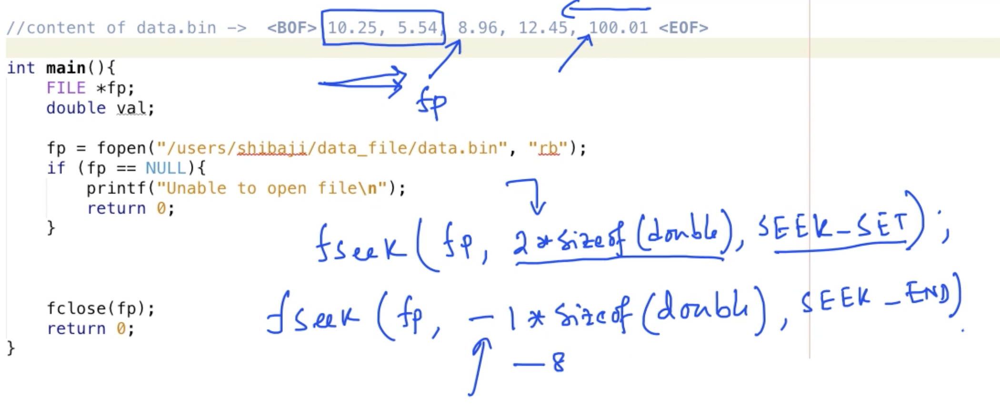
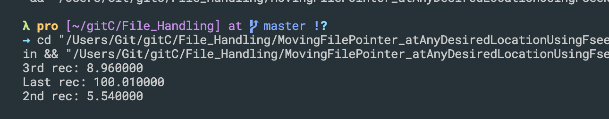
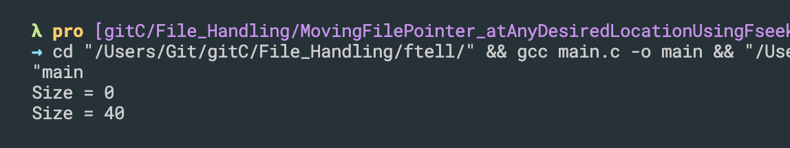
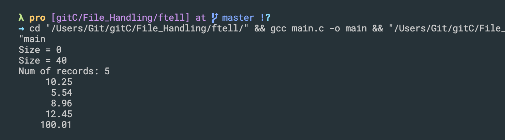

## Introduction to file handling, writing characters into a text file using fputc()
```c++
#include<stdio.h>

int main(){
    FILE *fp;
    fp = fopen("/Users/Git/gitc/File_Handling/data_file/a.txt", "w");
    //if want to write binary mode, using `wb`

    if(fp == NULL){
        printf("Unable to open file\n");
        return 1;
    }
    //file opened successfully

    fputc('a', fp);
    fputc('b', fp);

    fclose(fp);
    printf("Success\n");

    return 0;
}
```

---

- update
```c++
#include<stdio.h>

int main(){
    FILE *fp;
    fp = fopen("/Users/Git/gitc/File_Handling/data_file/a.txt", "w");
    //if want to write binary mode, using `wb`

    if(fp == NULL){
        printf("Unable to open file\n");
        return 1;
    }
    //file opened successfully
    char ch;
    for(ch = 'A'; ch<='Z'; ch++){
        fputc(ch, fp);
    }

    fclose(fp);
    printf("Success\n");

    return 0;
}
```

---


## Reading content of a text file character by character using fgetc()
```c++
#include<stdio.h>

int main(){
    FILE *fp;
    fp = fopen("/Users/Git/gitc/File_Handling/data_file/a.txt", "r");
    //if want to write binary mode, using `wb`

    if(fp == NULL){
        printf("Unable to open file\n");
        return 0;
    }

    //prime read
    char ch;
    ch = fgetc(fp);

    while(!feof(fp)){
        printf("%c", ch);
        ch = fgetc(fp);
    }

    fclose(fp);
    printf("\n");

    return 0;
}
```

---


## Reading a line from text file into a character array using fgets function
```c++
#include<stdio.h>
#define SIZE 80

int main(){
    FILE *fp;
    fp = fopen("/Users/Git/gitc/File_Handling/data_file/names.txt", "r");
    //if want to write binary mode, using `wb`

    if(fp == NULL){
        printf("Unable to open file\n");
        return 0;
    }

    char names[SIZE];
    while(1){
        fgets(names, SIZE, fp);
        printf("%s", names);
        if(feof(fp)){
            break;
        }
    }
    
    fclose(fp);
    printf("\n");
    return 0;
}
```

---


## Reading formatted data from text file using fscanf function
```c++
#include<stdio.h>
#define SIZE 80

int main(){
    FILE *fp;
    fp = fopen("/Users/Git/gitc/File_Handling/data_file/names1.txt", "r");
    //if want to write binary mode, using `wb`

    if(fp == NULL){
        printf("Unable to open file\n");
        return 0;
    }

    char name[SIZE];
    int salary;

    while(1){
        fscanf(fp, " %[^,],%d", name, &salary);
        printf("%s gets $%d per hour\n", name, salary);

        if(feof(fp)){
            break;
        }
    }
    
    fclose(fp);
    printf("\n");
    return 0;
}
```

---


## Writing formatted data into text file using fprintf function
- fprintf/main.c
```c++
#include<stdio.h>
#define SIZE 80

int main(){
    FILE *fp;
    FILE *fpr;

    fp = fopen("/Users/Git/gitc/File_Handling/data_file/names1.txt", "r");
    if(fp == NULL){
        printf("Unable to open file\n");
        return 0;
    }

    fpr = fopen("/Users/Git/gitc/File_Handling/data_file/reports.txt", "w");
    if(fpr == NULL){
        printf("Unable to open file\n");
        return 0;
    }

    char name[SIZE];
    int salary;

    while(1){
        fscanf(fp, " %[^,],%d", name, &salary);
        printf("%s gets $%d per hour\n", name, salary);
        fprintf(fpr, "%s gets $%d per hour\n", name, salary);

        if(feof(fp)){
            break;
        }
    }
    
    fclose(fp);
    printf("\n");
    return 0;
}
```

---


## Formatted data reading and writing - another example
- read_write/main.c
```c++
#include<stdio.h>
#define SIZE 80

int main(){
    FILE *fp;
    FILE *fpr;

    fp = fopen("/Users/Git/gitc/File_Handling/data_file/names1.txt", "r");
    if(fp == NULL){
        printf("Unable to open file\n");
        return 0;
    }

    fpr = fopen("/Users/Git/gitc/File_Handling/data_file/reports.txt", "w");
    if(fpr == NULL){
        printf("Unable to open file\n");
        return 0;
    }

    char name[SIZE];
    int salary;
    double pertHRA;
    double houseRent;
    double netSalary;

    while(1){
        fscanf(fp, " %[^,],%d, %lf", name, &salary, &pertHRA);
        // printf("%s gets $%d per hour\n", name, salary);
        houseRent = salary * pertHRA;
        netSalary = salary - houseRent;
        fprintf(fpr, "%-20s %10d %4.2lf %6.2lf %10.2lf \n", name, salary, pertHRA, houseRent, netSalary);

        if(feof(fp)){
            break;
        }
    }
    
    fclose(fp);
    printf("\n");
    return 0;
}
```

---


## Writing in binary mode - fwrite function
```c++
#include <stdio.h>

int main()
{
    FILE *fp;
    double data[] = {10.25, 5.54, 8.96, 12.45, 100.01};

    fp = fopen("/Users/Git/gitc/File_Handling/data_file/data.bin", "wb");
    if (fp == NULL)
    {
        printf("Unable to open file\n");
        return 0;
    }

    // fwrite((void *)(data + 1), sizeof(double), 2, fp);
    int nObject = fwrite((void *)(data), sizeof(double), 5, fp);
    printf("Total elements written: %d\n", nObject);

    fclose(fp);
    return 0;
}
```

---


## Reading in binary mode - fread function
- syntax: `size_t fread(void * buffer, size_t size, size_t count, FILE * stream)`
- Return Value: The function returns the number of objects read successfully. 

```c++
#include <stdio.h>

int main()
{
    FILE *fp;
    double data[5];

    fp = fopen("/Users/Git/gitc/File_Handling/data_file/data.bin", "rb");
    if (fp == NULL)
    {
        printf("Unable to open file\n");
        return 0;
    }

    int nObject = fread((void *)(data), sizeof(double), 5, fp);
    printf("Total elements written: %d\n", nObject);

    int i;
    printf("Content of array: ");
    for(i=0; i<5; i++){
        printf("%10.2lf", data[i]);
    }
    printf("\n");
    fclose(fp);
    return 0;
}
```

---

## Moving the file pointer at any desired location using fseek
```c++
#include <stdio.h>

//content of data.bin -> <BOF> 10.25, 5.54, 8.96, 12.45, 100.01 <EOF>
int main()
{
    FILE *fp;
    double val;

    fp = fopen("/Users/Git/gitc/File_Handling/data_file/data.bin", "rb");
    if (fp == NULL)
    {
        printf("Unable to open file\n");
        return 0;
    }

    fseek(fp, 2 * sizeof(double), SEEK_SET);
    fread((void *)&val, sizeof(double), 1, fp);

    printf("3rd rec: %lf\n", val);

    printf("\n");
    fclose(fp);
    return 0;
}
```

- `fseek(fp, 2 * sizeof(double), SEEK_SET);`
- at the beginning, pointer point to 0, 
- after move `2 * sizeof(double)`
- SEEK_SET : It denotes starting of the file. means at 0
- so if this is goint to move 16 bytes from the beginning

- SEEK_END : It denotes end of the file.
- SEEK_CUR : It denotes file pointer’s current position.
-
- one more example:
- `fseek(fp,-20L,2)`, 指的是文件末尾偏移20个字节, 第二个参数指的是偏移方向和偏移量
- `-20L`指的是后退20个字节； 
- 第三个参数指的是从哪里开始偏移; 0=文件开头，1=起始位置，2=文件末尾


- update
```c++
#include <stdio.h>

//content of data.bin -> <BOF> 10.25, 5.54, 8.96, 12.45, 100.01 <EOF>
int main()
{
    FILE *fp;
    double val;

    fp = fopen("/Users/Git/gitc/File_Handling/data_file/data.bin", "rb");
    if (fp == NULL)
    {
        printf("Unable to open file\n");
        return 0;
    }

    fseek(fp, 2 * sizeof(double), SEEK_SET);
    fread((void *)&val, sizeof(double), 1, fp);

    printf("3rd rec: %lf\n", val);

    fseek(fp, -1 * sizeof(double), SEEK_END);
    fread((void *)&val, sizeof(double), 1, fp);

    printf("Last rec: %lf\n", val);

    fseek(fp, 1 * sizeof(double), SEEK_SET);
    fread((void *)&val, sizeof(double), 1, fp);

    printf("2nd rec: %lf\n", val);

    printf("\n");
    fclose(fp);
    return 0;
}
```

---


## Calculating the number of records in a binary file using ftell
- ftell() in C is used to find out the position of file pointer in the file with respect to starting of the file. Syntax of ftell() is:
- syntax: `long ftell(FILE *pointer)`
```c++
//Calculating the number of records in a binary file using ftell
#include <stdio.h>

//content of data.bin -> <BOF> 10.25, 5.54, 8.96, 12.45, 100.01 <EOF>
int main()
{
    FILE *fp;


    fp = fopen("/Users/Git/gitc/File_Handling/data_file/data.bin", "rb");
    if (fp == NULL)
    {
        printf("Unable to open file\n");
        return 0;
    }
    long size;
    size = ftell(fp);
    printf("Size = %ld\n", size);

    fseek(fp, 0L, 2);
    size = ftell(fp);
    printf("Size = %ld\n", size);

    printf("\n");
    fclose(fp);
    return 0;
}
```

-
- update
```c++
//Calculating the number of records in a binary file using ftell
#include <stdio.h>
#include<stdlib.h>

//content of data.bin -> <BOF> 10.25, 5.54, 8.96, 12.45, 100.01 <EOF>
int main()
{
    FILE *fp;


    fp = fopen("/Users/Git/gitc/File_Handling/data_file/data.bin", "rb");
    if (fp == NULL)
    {
        printf("Unable to open file\n");
        return 0;
    }
    long size;
    size = ftell(fp);
    printf("Size = %ld\n", size);

    fseek(fp, 0L, 2);
    size = ftell(fp);
    printf("Size = %ld\n", size);

    int n = size/sizeof(double);
    printf("Num of records: %d\n", n);

    double *data;
    data = (double *)malloc(sizeof(double) * n);
    fseek(fp, 0L, 0);

    fread((void *)data, sizeof(double), n, fp);

    for(int i=0; i<n; i++){
        printf("%10.2lf\n", data[i]);
    }

    printf("\n");
    fclose(fp);
    return 0;
}
```

