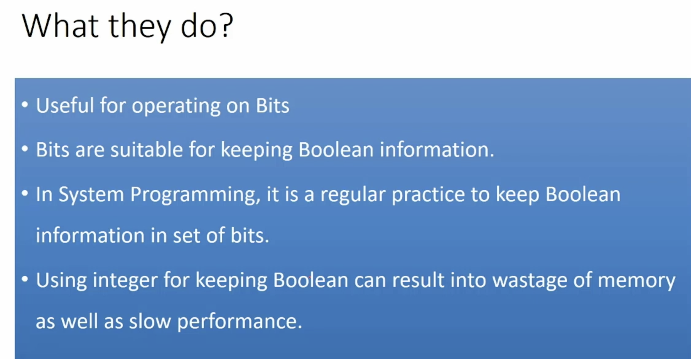
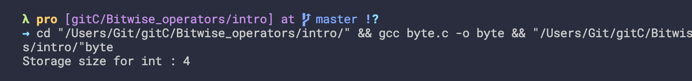
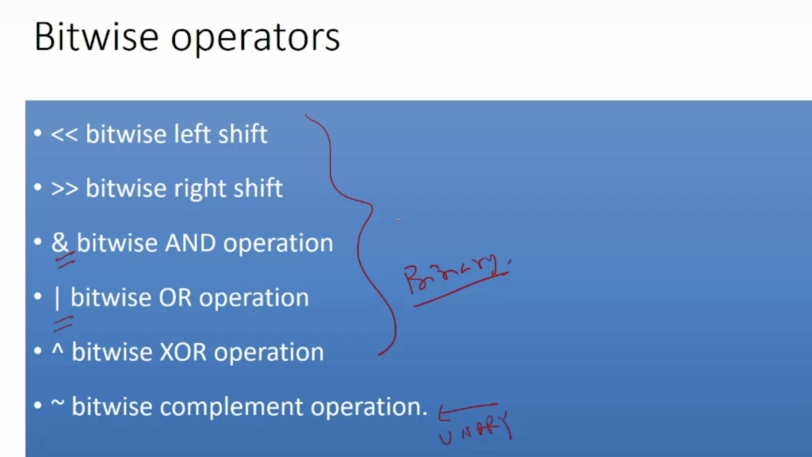
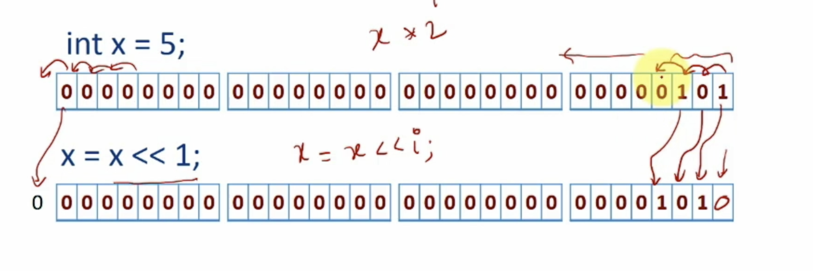

## Introduction to bitwise operators

- check self int bytes
```c
#include <stdio.h>
#include <limits.h>
 
int main() {
   printf("Storage size for int : %lu \n", sizeof(int));
   
   return 0;
}
```

---

- if we are using a variable for keeping the boolean information of our set of boolean information
- we can use the bitwise operator for initializing each bit of that variable and manipulate them 

---

## Bitwise leftshift operator

