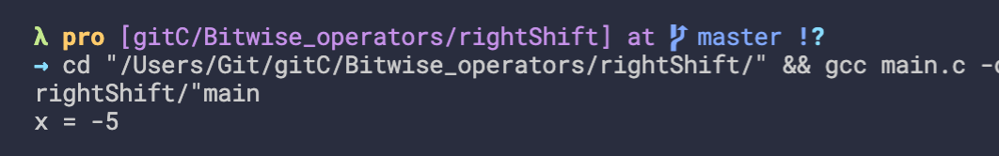

## Introduction to bitwise operators

- check self int bytes
```c
#include <stdio.h>
#include <limits.h>
 
int main() {
   printf("Storage size for int : %lu \n", sizeof(int));
   
   return 0;
}
```

---

- if we are using a variable for keeping the boolean information of our set of boolean information
- we can use the bitwise operator for initializing each bit of that variable and manipulate them 

---

## Bitwise leftshift operator


```c
#include<stdio.h>
int main(){
    int x = 5;
    x = x << 2;
    printf("x = %d\n", x);
    return 0;
}
```
- `X * 2^i`
- 
- `x = 20`
---

## Bitwise right shift operator


```c
#include<stdio.h>
int main(){
    int x = 20;
    x = x >> 1;
    printf("x = %d\n", x);
    return 0;
}
```
- `x / 2^i`


-
-
```c
#include<stdio.h>
int main(){
    int x = -20;
    x = x >> 2;
    printf("x = %d\n", x);
    return 0;
}
```

---

## Bitwise AND operator - how to check a bit

- what is the benefit of having this bitwise `AND` operation
- The benefit is that using this bitwise and we can check if a particular bit is 1 or 0
- That means that particular bit of a particular variable is set / unset


- if get 0, the number is even
```c
#include<stdio.h>
/**
 * check if a number is odd or even without using modulo operator %
*/
int main(){
    int x;
    printf("Enter a number: ");
    scanf("%d", &x);

    if((x & 1) == 1){
        printf("%d is odd\n", x);
    }else{
        printf("%d is even\n", x);
    }
   
    return 0;
}
```

---


## Count set bits - Using bitwise `AND` and `left shift`

