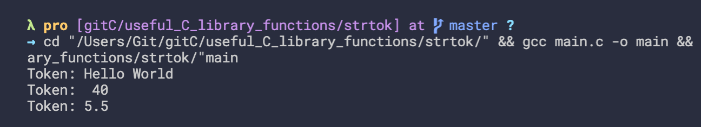

## sprintf and snprintf - write formatted string into character array
```c++
#include<stdio.h>
#include<string.h>
/**
 * sprintf - write a formatted string into a character array
 * Just like printf, but it prints the string into an array instead of printing into the console
*/
int main(){
    int var1 = 10;
    double var2 = 2.25;
    char buff_string[100];

    sprintf(buff_string, "Value of var1 = %d and var2 = %lf\n", var1, var2);

    printf("%s", buff_string);
    return 0;
}

```

-
- update
```c++
#include<stdio.h>
#include<string.h>
/**
 * sprintf - write a formatted string into a character array
 * Just like printf, but it prints the string into an array instead of printing into the console
*/
int main(){
    int var1 = 10;
    double var2 = 2.25;
    char buff_string[100];

    int count = sprintf(buff_string, "Value of var1 = %d and var2 = %lf\n", var1, var2);

    printf("%s", buff_string);
    printf("count = %d\n", count);
    return 0;
}
```

---

- update
```c++
#include<stdio.h>
#include<string.h>
/**
 * sprintf - write a formatted string into a character array
 * Just like printf, but it prints the string into an array instead of printing into the console
*/
int main(){
    int var1 = 10;
    double var2 = 2.25;
    char buff_string[100];
    char str[] = ", this is fun!";
    int count = sprintf(buff_string, "Value of var1 = %d and var2 = %lf%s\n", var1, var2, str);

    printf("%s", buff_string);
    printf("count = %d\n", count);
    return 0;
}
```

---

## strtok - great tool to extract information from a string separated by delimiters
```c++
#include<stdio.h>
#include<string.h>
//use of strtok

int main(){
    char source[] = "Hello World, 40#5.5,400,2.5";
    char delims[] = ",#";

    char *token;
    token = strtok(source, delims);
    printf("Token: %s\n", token);

    return 0;
}
```

-
- update
```c++
#include<stdio.h>
#include<string.h>
//use of strtok

int main(){
    char source[] = "Hello World, 40#5.5,400,2.5";
    char delims[] = ",#";

    char *token;
    token = strtok(source, delims);
    printf("Token: %s\n", token);

    token = strtok(NULL, delims);
    printf("Token: %s\n", token);
    
    token = strtok(NULL, delims);
    printf("Token: %s\n", token);


    return 0;
}
```

---


- update
```c++
#include<stdio.h>
#include<string.h>
//use of strtok

int main(){
    char source[] = "Hello World, 40#5.5,400,2.5";
    char delims[] = ",#";

    char *token;
    token = strtok(source, delims);

    while(token != NULL){
        printf("Token: %s\n", token);
        token = strtok(NULL, delims);
    }

    return 0;
}
```

---

## memset - learn how to initialize block of memory with a character using memset


```c++
#include<stdio.h>
#include<string.h>

int main(){
    char my_str[]="Blah blah, Hello World!!";
    memset(my_str, '@', 4);

    printf("%s\n", my_str);
    return 0;
}
```

---

- update

```c++
#include<stdio.h>
#include<string.h>

int main(){
    char my_str[]="Blah blah, Hello World!!";
    memset(my_str + 5, '@', 4);

    printf("%s\n", my_str);
    return 0;
}
```

---

-
```c++
#include<stdio.h>
#include<stdlib.h>
#include<string.h>

int main(){
    char my_str[]="Blah blah, Hello World!!";
    memset(my_str + 5, '@', 4);

    printf("%s\n", my_str);
    char *p = (char *)malloc(sizeof(char) * 20);
    memset(p, '\0', 20);
    memset(p, '-', 19);
    printf("%s\n", p);   

    return 0;
}
```

---


## memcpy - copy from one memory block to other byte-by-byte
```c++
#include<stdio.h>
#include<stdlib.h>
#include<string.h>

int main(){
    char source[]="Blah blah, Hello World!!";
    char destination[100];
    memcpy(destination, source, 4);
    destination[4] = '\0';
    printf("%s\n", destination);

    return 0;
}
```


```c++
#include<stdio.h>
#include<stdlib.h>
#include<string.h>

int main(){
    int *p = (int *)malloc(sizeof(int) *10);
    int i = 0;
    srand(time(NULL));
    for(i=0; i<10; ++i){
        *(p + i) = rand() % 100;
    }
    printf("Content of first block: ");
    for(i = 0; i<10; ++i){
        printf("%4d", *(p + i));
    }
    int *q = (int *)malloc(sizeof(int) * 5);

    mmecpy(q, p, 20);

    printf("Content of second block: ");
    for(i = 0; i<5; ++i){
        printf("%4d", *(q + i));
    }

    return 0;
}
```

