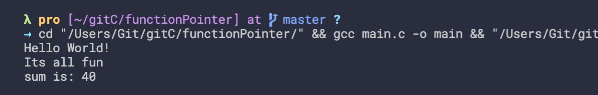
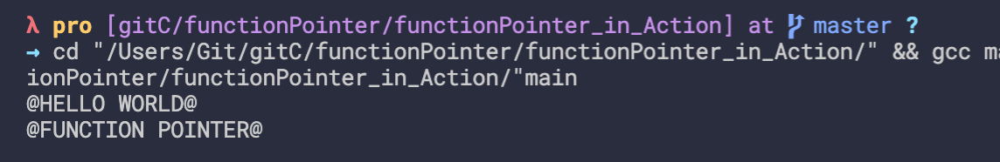

## How to declare a function pointer
```c
#include<stdio.h>
#include<stdlib.h>
//Function pointer

void printMsg(){
    printf("Hello World!\n");
}

void fun(){
    printf("Its all fun\n");
}

int sum(int a, int b){
    return a + b;
}

int main(){
    void (*p)();

    p = printMsg;
    p();
    p = fun;
    p();

    int (*s)(int, int);
    s = sum;

    int result = s(10, 30);
    printf("sum is: %d\n", result);

    float(*fptr)(int[], float);


    return 0;
}
```

---


## Function pointer in Action - Program that use function pointer
```c
#include<stdio.h>
#include<stdlib.h>
#include<ctype.h>
//Function pointer

void changeToUpperCase(char str[]){
    int i=0;
    for(i = 0; str[i]!='\0'; ++i){
        if(str[i] >= 'a' && str[i] <= 'z'){
            str[i] -= 32;
        }
    }
}

void changeToLowerCase(char str[]){
    int i=0;
    for(i = 0; str[i]!='\0'; ++i){
        if(str[i] >= 'A' && str[i] <= 'Z'){
            str[i] += 32;
        }
    }
}

int main(){
    char str[] = "@Hello world@";
    changeToUpperCase(str);
    printf("%s\n", str);


    return 0;
}
```
---

- update
```c
#include<stdio.h>
#include<stdlib.h>
#include<ctype.h>
//Function pointer

char toUpperCase(char ch){
    return (ch >= 'a' && ch <= 'z') ? (ch - 32) : ch;
}

char toLowerCase(char ch){
    return (ch >= 'A' && ch <= 'Z') ? (ch + 32) : ch;
}

void changeCase(char str[], char(*ch_ptr)(char)){
    int i=0;
    for(i = 0; str[i]!='\0'; ++i){
        str[i] = ch_ptr(str[i]);
    }
}

int main(){
    char str[] = "@Hello world@";
    changeCase(str, toUpperCase);
    printf("%s\n", str);
    
    char str1[] = "@FUNCTION POINTER@";
    changeCase(str, toUpperCase);
    printf("%s\n", str1);


    return 0;
}
```

