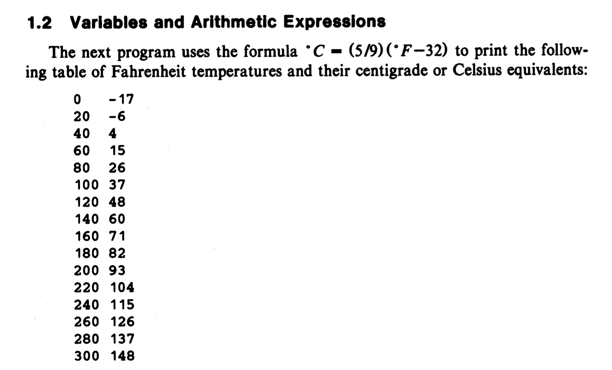

```c++
#include <stdio.h>
//print Fahrenheit-Celsius table for fahr = 0,20,...,300 
int main()
{
    int fahr, cesius;
    int lower, upper, step;

    lower = 0;  /* lower limit of temperature table */
    upper = 300; /*upper limit*/
    step = 20;/*step size*/

    fahr = lower;
    while(fahr <= upper){
        cesius = 5 *(fahr-32)/9;
        printf("%d\t%d\n", fahr,cesius);
        fahr = fahr+step;
    }
    return 0; 
}
```

---
