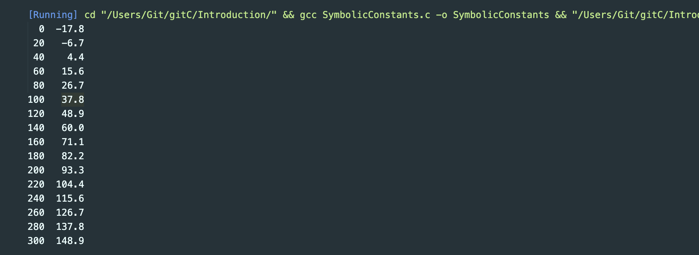
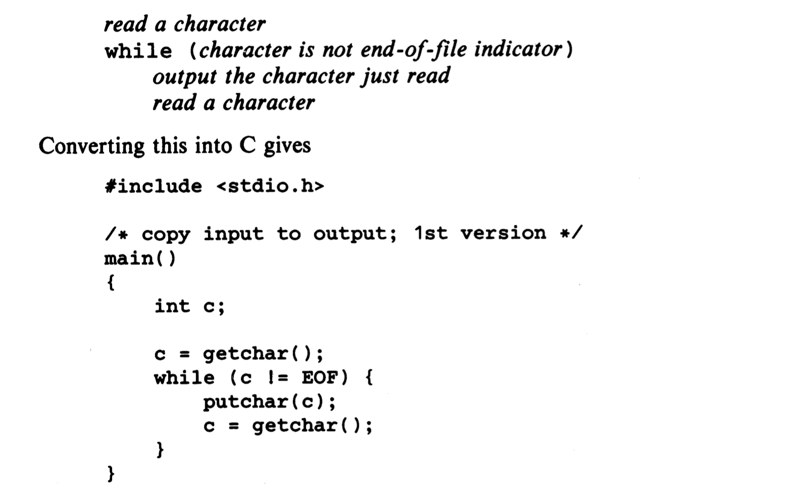
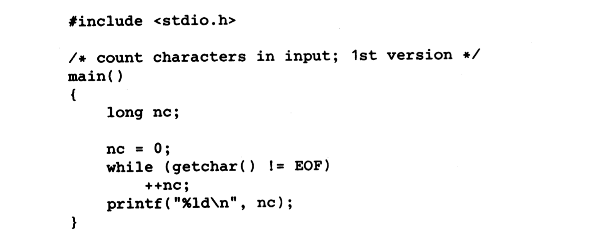
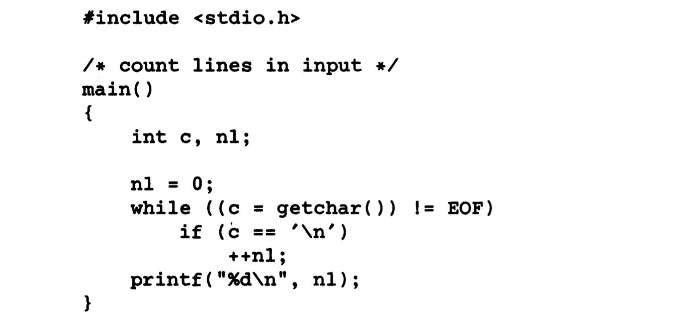
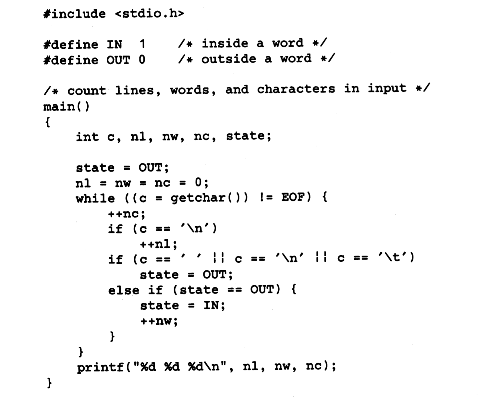

```c++
#include <stdio.h>
//print Fahrenheit-Celsius table for fahr = 0,20,...,300 
int main()
{
    int fahr, cesius;
    int lower, upper, step;

    lower = 0;  /* lower limit of temperature table */
    upper = 300; /*upper limit*/
    step = 20;/*step size*/

    fahr = lower;
    while(fahr <= upper){
        cesius = 5 *(fahr-32)/9;
        printf("%d\t%d\n", fahr,cesius);
        fahr = fahr+step;
    }
    return 0; 
}
```

---
### symbolic constant
- It's bad practice to bury "magic numbers" like 300 and 20
- One way to deal with magic numbers is to give them meaningful names
```c++
#include<stdio.h>

#define LOWER 0
#define UPPER 300
#define STEP 20

int main(){
    int fahr;
    for(fahr = LOWER; fahr <= UPPER; fahr = fahr + STEP){
        printf("%3d %6.1f\n", fahr, (5.0/9.0)*(fahr-32));
    }
    return 0;
}
```

---

### Character Input and Output
- The standard library provides several functions for reading or writing one character at a time, of which `getchar` and `putchar` are the simplest. 
- Each time it is called, getchar reads the next input character from a text stream and returns that as its value.
- `c = getchar()`
- The function putchar prints a character each time it is called:
- `putchar(c)`
---

### File Copying
- Given getchar and putchar, you can write a surprising amount of useful code without knowing anything more about input and output. The simplest example is program that copies its input to its output one character at a time:


### Character Counting


### Line Counting


### Word Counting
- This program counts `lines`, `words`, `characters`

---

### Arrays
- Let us write a program to count the number of occurrences of each digit, of white space characters (blank, tab, newline), and of all other characters. This is artificaial, but it permits us to illustrate several aspects of C in one program.