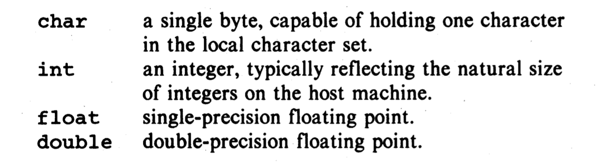
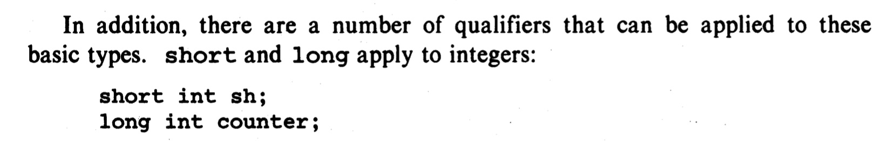
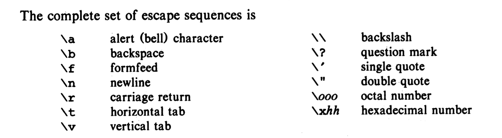

### Data Type


- short is often 16 bits, long 32 bits, int either 16 or 32 bits

---

- Technically, a string constant is an array of characters. The internal representation of a string has a null character '\0' at the end
- The standard library function strlen(s) returns the length of its character string argument s, excluding the terminal '\0'.

### character
- different way to print a char
```c++
#include<stdio.h>
#include<stdlib.h>

int main(){
    char ch = 'A';
    putchar(ch);
    printf("%c", 'A');
    //ch size: 1,   A size: 4
    return 0;
}
```
