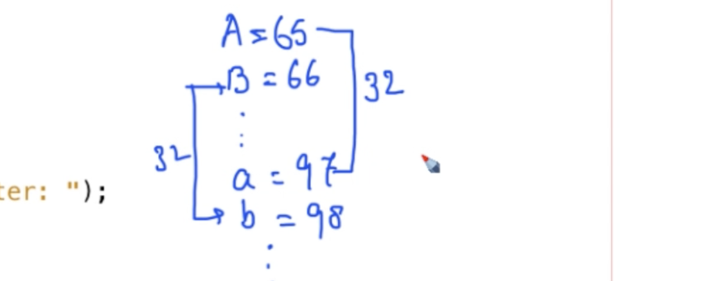
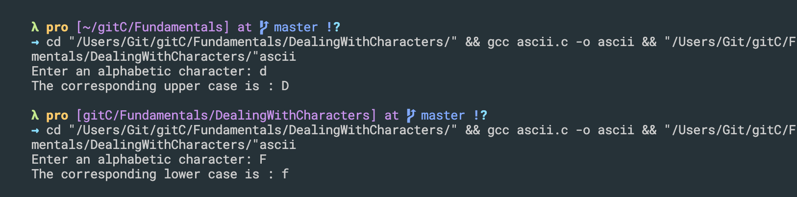
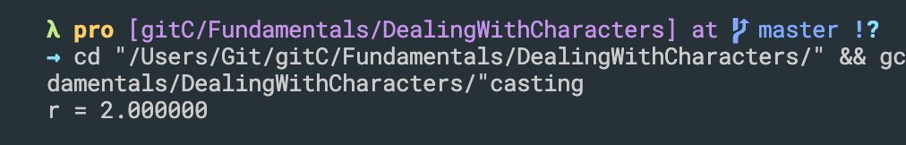
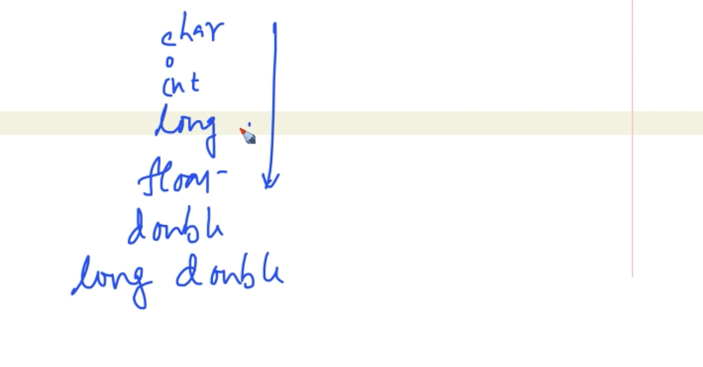
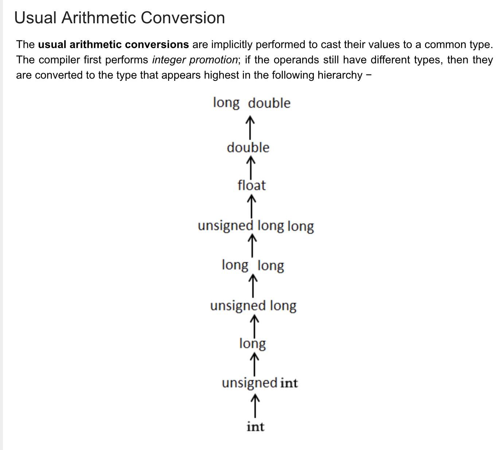
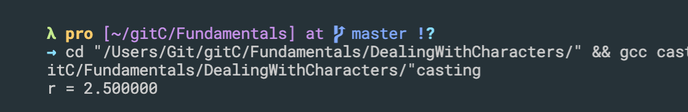

## Printing content of variable using printf
```c++
#include <stdio.h>
#include <stdlib.h>

int main(){
    int id = 5;
    int age = 20;
    double weight = 50.75;
    char grade = 'A';

    printf("The content of ID is: %d\n", id);

    printf("The content of ID is: %d, age=%d, weight=%f\n", id, age, weight);
    return 0;
}
```

---

## Reading Data from keyboard into variable using scanf.
```c++
#include <stdio.h>
#include <stdlib.h>

int main(){
    int age;
    printf("Enter age: ");
    scanf("%d", &age);
    printf("Age = %d\n", age);

    return 0;
}
```

---

## Initialization of variable, octal and hexadecimal initialization
```c++
int main(){
    int aVar = 015;
    printf("Content of aVar = %d\n", aVar);
    //Content of aVar = 13
    printf("Content of aVar = %o\n", aVar);
    printf("Content of aVar = %x\n", aVar);
    return 0;
}
```

---

## Arithmetical Operators in C
```c++
int main(){
    int a = 10, b = 2;

    printf("%d + %d = %d\n", a, b, a+b);
    printf("%d - %d = %d\n", a, b, a-b);
    printf("%d * %d = %d\n", a, b, a*b);
    printf("%d / %d = %d\n", a, b, a/b);
    printf("%d %% %d = %d\n", a, b, a%b);

    return 0;
}
```

---

## Dealing with characters
- input a character from keyboard 1st way:
```c++
#include <stdio.h>
#include <stdlib.h>

int main()
{
    char ch = 'A';
    printf("Character is %c\n", ch);
    printf("Enter a character: ");

    char another;
    scanf("%c", &another);
    printf("You have typed : %c\n", another);
    return 0;
}
```

-

- 2nd way
```c++
//2nd way input a character from keyboard
int main()
{
    char ch = 'A';
    printf("Character is %c\n", ch);
    printf("Enter a character: ");

    char another;
    another = getchar();
    printf("You have typed : %c\n", another);
    return 0;
}
```

---

## ASCII : American Standard Code for Information Interchange
- for capital A is 65, B for 66, C for 67
- for small letter is actually assigned a value 97
-
```c++
int main()
{
    char ch = 'A';
    printf("%d - %c\n", ch, ch);

    int i=65;
    printf("%d - %c\n", i, i);
    printf("\n");
    printf("**********************************\n");

    for(i=65; i<91; i++){
        printf("%d - %c\n", i, i);
    }

    return 0;
}
```

---

## convert capital to smaller letter, idea:

- Similarly, if we want to convert lower case to capital, just need to `- 32`
- update
```c++
#include <stdio.h>
#include <stdlib.h>

int main()
{
    char ch;
    printf("Enter an alphabetic character: ");
    scanf("%c", &ch);

    if (ch >= 'A' && ch <= 'Z')
    {
        ch = ch + 32;
        printf("The corresponding lower case is : %c\n", ch);
    }
    else if (ch >= 'a' && ch <= 'z')
    {
        ch = ch - 32;
        printf("The corresponding upper case is : %c\n", ch);
    }
    else
    {
        printf("The given character is not alphabetic\n");
    }
    return 0;
}
```

---

## Flushing problem while taking character input

```c++
#include <stdio.h>
#include <stdlib.h>

int main()
{
    char ch;
    int i, j;
    printf("Enter an integer: \n");
    scanf("%d", &i);
    printf("Enter a character: \n");
    scanf("%c", &ch);
    printf("Enter another integer: \n");
    scanf("%d", &j);

    return 0;
}
```
---

## Idea of casting
- update
```c++
#include <stdio.h>
#include <stdlib.h>

int main()
{
    int a = 5, b = 2;
    float r;
    r = a / b;
    printf("r = %f\n", r);

    return 0;
}
```

- since a/b, is `int/int = int`, ans is 2, not 2.5
- then assigned to our float r


- update
```c++
#include <stdio.h>
#include <stdlib.h>

int main()
{
    int a = 5, b = 2;
    float r;
    // r = a / b;

    // r = (float)a / b;

    r = a / (float)b;
    printf("r = %f\n", r);

    return 0;
}
```

---


## 