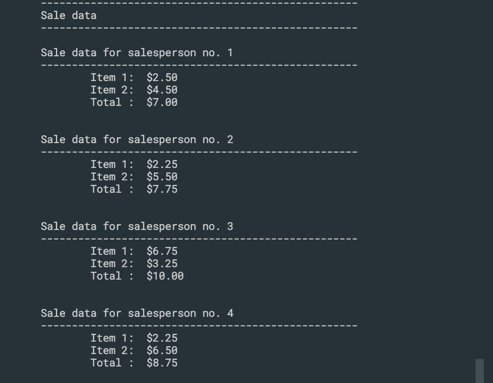

## Introduction to two dimensional array


```c++
#include <stdio.h>
int main()
{
    int x[4][3];
    int i, j;

    for (i = 0; i < 4; i++)
    {
        for (j = 0; j < 3; j++)
        {
            x[i][j] = i * j;
        }
    }
    printf("Content of the 2D array: \n");
    for (i = 0; i < 4; i++)
    {
        for (j = 0; j < 3; j++)
        {
            printf("%4d", x[i][j]);
        }
        printf("\n");
    }
    return 0;
}
```

---


## 2-D array programming example


---
```c++
#include <stdio.h>
int main()
{
    int r, c;
    //r is no of salesperson, c is no of items that they sale
    //input for r and c
    printf("Enter number of saleperson: ");
    scanf("%d", &r);
    printf("Enter number of items: ");
    scanf("%d", &c);
    printf("\n\n\n");

    //declare 2d array
    double saleData[r][c];
    //input saleData into the array
    printf("Enter sale data: \n\n");
    int i, j;
    for (i = 0; i < r; i++)
    {
        for (j = 0; j < c; j++)
        {
            printf("Sale amt for salesperson no %d item no %d: ", i + 1, j + 1);
            scanf("%lf", &saleData[i][j]);
        }
    }

    //display report
    printf("---------------------------------------------------\n");
    printf("Sale data\n");
    printf("---------------------------------------------------\n\n");
    double total = 0.0;
    
    for (i = 0; i < r; i++)
    {
        printf("Sale data for salesperson no. %d\n", i + 1);
        printf("---------------------------------------------------\n");
        total = 0.0;
        for (j = 0; j < c; j++)
        {
            printf("\tItem %d:  $%0.2lf\n", j + 1, saleData[i][j]);
            total += saleData[i][j];
        }
        printf("\tTotal :  $%0.2lf\n", total);
        printf("\n\n");
    }

    return 0;
}
```


