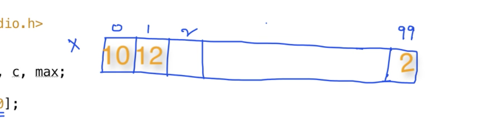
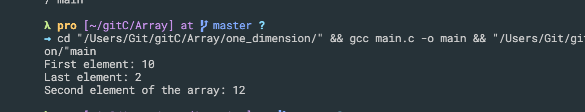
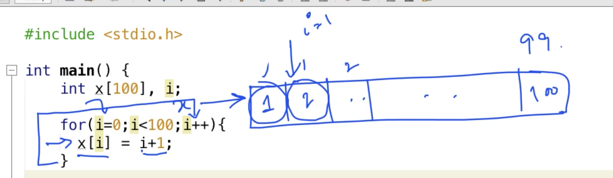
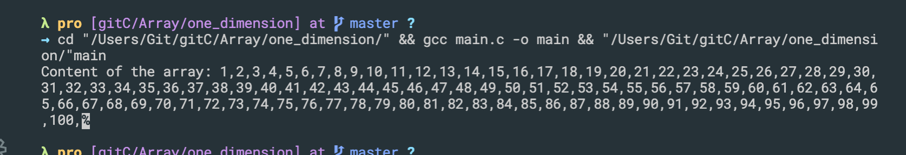
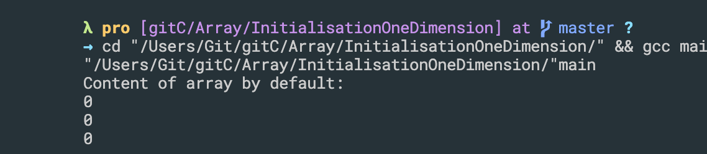
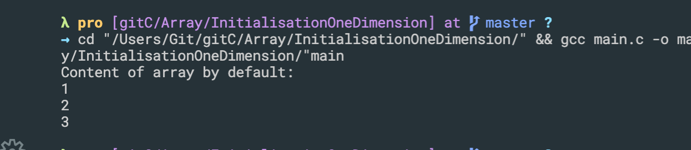
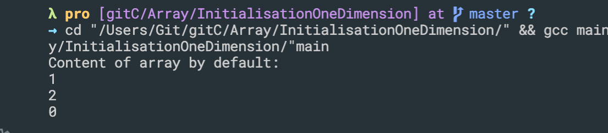
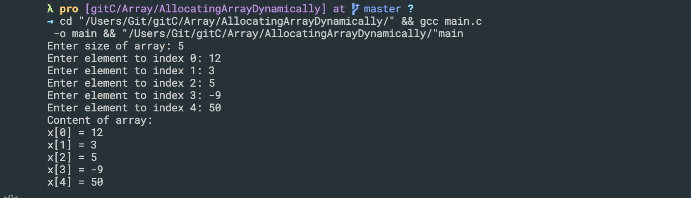

## One Dimension array
```c++
#include <stdio.h>

int main()
{
    int a, b, c, max;
    int x[100];
    x[0] = 10;
    x[99] = 2;
    printf("First element: %d\n", x[0]);
    printf("Last element: %d\n", x[99]);

    x[1] = x[0] + x[99];
    printf("Second element of the array: %d\n", x[1]);
    return 0;
}
```


---


- update
```c++
int main()
{
    int x[100], i;

    for (i = 0; i < 100; i++)
    {
        x[i] = i + 1;
    }
    printf("Content of the array: ");
    for(i=0; i<100; i++){
        printf("%d,", x[i]);
    }

    return 0;
}
```


---


## Initialisation of one dimensioal array
```c++
#include<stdio.h>

int main(){
    int x[3] ={0}, i;
    printf("Content of array by default: \n");
    for(i = 0; i<3; i++){
        printf("%d\n", x[i]);
    }
    return 0;
}
```

---

- update
```c++
int main(){
    int x[3] ={1, 2, 3}, i;
    printf("Content of array by default: \n");
    for(i = 0; i<3; i++){
        printf("%d\n", x[i]);
    }
    return 0;
}
```

---

```c++
int main(){
    // int x[3] ={1, 2, 3}, i;
    int x[3] ={1, 2}, i;
    printf("Content of array by default: \n");
    for(i = 0; i<3; i++){
        printf("%d\n", x[i]);
    }
    return 0;
}
```

---


## Allocating array dynamically
```c++
#include <stdio.h>

int main()
{
    int n;
    printf("Enter size of array: ");
    scanf("%d", &n);

    int x[n];
    int i;
    for (i = 0; i < n; i++)
    {
        printf("Enter element to index %d: ", i);
        scanf("%d", &x[i]);
    }
    printf("Content of array: \n");
    for (i = 0; i < n; i++)
    {
        printf("x[%d] = %d\n", i, x[i]);
    }

    return 0;
}
```

---


## An Example using 1D array


