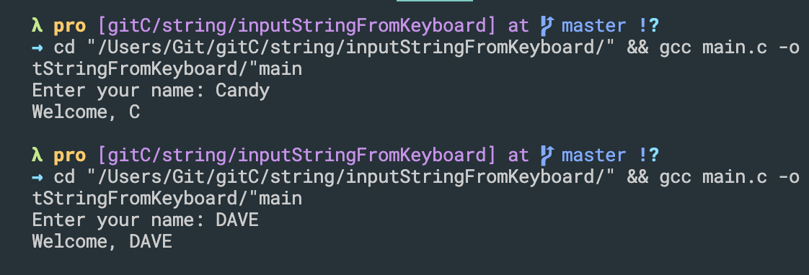
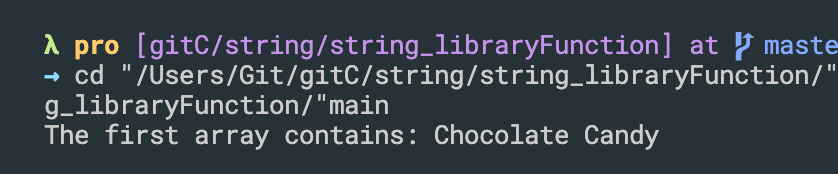

## Using character array for storing string

- index 11, storing `\0`, this is implicit, you don't need to worry about 
- this is going to demarcate(划分界线) your string

```C++
#include<stdio.h>
#include<string.h>

int main(){
    // char str[80]="Hello World";
    
    char str[80];

    strcpy(str, "Hello World");

    printf("Message is: %s\n", str);
    return 0;
}
```

- `strcpy()` is a library function, so need to import string.h

- update
```c++
#include <stdio.h>
#include <string.h>

int main()
{
    // char str[80]="Hello World";

    char str[80];

    strcpy(str, "Hello World");

    printf("Message is: %s\n", str);

    char str1[] = "Hello Candy";
    strcpy(str, str1);
    printf("%s\n", str1);

    return 0;
}
```

---


## How to input string from keyboard
```c++
#include <stdio.h>
int main()
{
    char str[80];
    printf("Enter your name: ");
    scanf("%s", str);

    printf("Welcome, %s\n", str);
    return 0;
}
```

---

- reguar expression
```c++
//regular expression
int main()
{
    char str[80];
    printf("Enter your name: ");
    scanf("%[A-Z]", str);

    printf("Welcome, %s\n", str);
    return 0;
}
```

- In this case it's good to accept all the uppercase letters 
-
```c++
int main()
{
    char str[80];
    printf("Enter your name: ");
    // scanf("%[A-Z]", str);
    scanf("%[A-Za-z]", str);

    printf("Welcome, %s\n", str);
    return 0;
}
```

- note: space is not here

- 

```c++
//regular expression
int main()
{
    char str[80];
    printf("Enter your name: ");

    scanf("%[A-Za-z ]", str);

    printf("Welcome, %s\n", str);
    return 0;
}
```

---
-


```c++
//regular expression
int main()
{
    char str[80];
    printf("Enter your name: ");
    scanf("%[^\n]", str);

    printf("Welcome, %s\n", str);
    return 0;
}
```

- this means accept anythign from keyboard **except** the new line character
- so as long as we're going to type in characters from keyboardf it will be accepted unless and until it's a return key
---
-
```c++
//regular expression
int main()
{
    char str[80];
    printf("Enter your name: ");
    scanf("%[^A]", str);

    printf("Welcome, %s\n", str);
    return 0;
}
```


- now that means that is going to accept a string from keyboard **excepat** capital A
- when we give a capital A then it's going to put a null character and **terminate**
---


## Finding the length of string


```c++
#include <stdio.h>
#include <string.h>
int main()
{
    char str[80];
    printf("Enter a string: ");
    scanf("%[^\n]", str);

    int i;
    for (i = 0; str[i] != '\0'; i++)
    {
        
    }
    printf("The string length is: %d\n", i);
    return 0;
}
```

---

- we can also using string library `strlen()`

```c++
#include <stdio.h>
#include <string.h>
int main()
{
    char str[80];
    printf("Enter a string: ");
    scanf("%[^\n]", str);

    int i;
    i = strlen(str);

    printf("The string length is: %d\n", i);
    return 0;
}
```

---


## Searching and counting target in string
```c++
#include <stdio.h>
//input a string and count no of alphabets and spaces in the string, finally 
//print your result into the console
int main(){

    char str[80];
    printf("Enter a string: ");
    scanf("%[^\n]", str);

    int i, countAlpha = 0, countSpace=0;

    for(i=0; str[i]!='\0'; i++){
        if((str[i] >= 'A' && str[i]<='Z') || (str[i] >= 'a' && str[i]<='z')){
            countAlpha++;
        }else if(str[i] == ' ' || str[i] == 32){
            countSpace++;
        }
    }
    printf("Total alphabetic characters found: %d\n", countAlpha);
    printf("Total spaces characters found: %d\n", countSpace);


    return 0;
}
```

- Note: `else if(str[i] == ' ' || str[i] == 32)` , since space is `32`
---


## Library function for string operations, string.h

```c++
#include<stdio.h>
#include<string.h>

int main(){
    char first[80]="Chocolate Candy";
    char second[80];

    strcpy(second, first);
    printf("Copied sring: %s\n", second);

    return 0;
}
```

---


```c++
#include<stdio.h>
#include<string.h>

int main(){
    char first[80]="Chocolate";
    char second[80]="Candy";

    strcat(first, second);
    printf("The first array contains: %s\n", first);

    return 0;
}
```

---
-
- we can append space first
```c++
int main(){
    char first[80]="Chocolate";
    char second[80]="Candy";

    strcat(first, " ");
    strcat(first, second);
    printf("The first array contains: %s\n", first);

    return 0;
}
```

---

- string compare function
```c++
#include<stdio.h>
#include<string.h>

int main(){
    char first[80]="cat";
    char second[80]="zebra";

    int i;
    i = strcmp(first, second);
    if(i==0){
        printf("Both are exactly equal\n");
    }else if(i<0){
        printf("%s comes first\n", first);
    }else{
        printf("%s comes first\n", second);
    }

    return 0;
}
```


