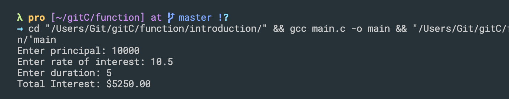
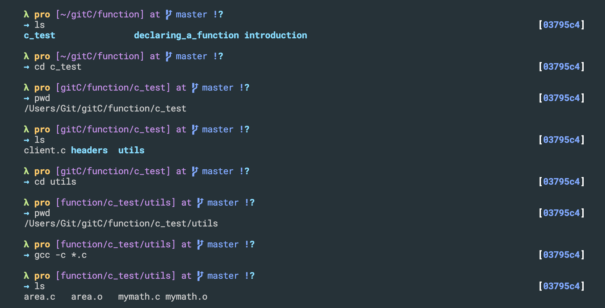

## introduction
```c++
#include<stdio.h>

double getSimpleInterest(double principal, double rate, double time){
    double interest;
    interest = (principal * rate * time)/100.0;
    return interest;
}

int main(){
    double p, r, t, i;
    printf("Enter principal: ");
    scanf("%lf", &p);
    printf("Enter rate of interest: ");
    scanf("%lf", &r);
    printf("Enter duration: ");
    scanf("%lf", &t);

    i = getSimpleInterest(p, r, t);
    printf("Total Interest: $%0.2lf\n", i);
    
    return 0;
}
```

---


## Prototype or signature of function, declaring a function

```c++
#include<stdio.h>

double getSimpleInterest(double, double, double);

int main(){
    double i;

    i = getSimpleInterest(1000.0, 5.0, 2);
    printf("Total Interest: $%0.2lf\n", i);
    
    return 0;
}


double getSimpleInterest(double principal, double rate, double time){
    double interest;
    interest = (principal * rate * time)/100.0;
    return interest;
}
```
---


## Create your own library, distribute functions to others
- create a folder `c_test`

- headers/area.h
```c++
#ifndef AREA_H
#define AREA_H

double getCircleArea(double);
double getTriangleArea(double, double);

#endif
```
-
- headers/mymath.h
```c++
#ifndef MYMATH_H
#define MYMATH_H

double getSimpleInterest(double, double, double);

#endif
```
-
- utils/area.c
```c++
double getCircleArea(double rad){
    double area;
    area = 3.14 * rad * rad;
    return area;
}


double getTriangleArea(double base, double height){
    double area;
    area = 0.5 * base * height;
    return area;
}
```
-
- utils/mymath.c
```c++
double getSimpleInterest(double principal, double rate, double time){
    double interest;
    interest = (principal * rate * time)/100.0;
    return interest;
}
```

- `ar -cvq libxutils.a *.o`,  create own library

---

- create c_test/client.c
```c++
#include<stdio.h>
#include "headers/area.h"
#include "headers/mymath.h"
int main(){
    double interest;
    interest = getSimpleInterest(10000.00, 10.0, 5.0);
    printf("Interest is : %lf\n", interest);

    double t_area = getTriangleArea(5.0, 7.5);
    double c_area = getCircleArea(5.5);

    printf("Area of the triangle: %lf\n", t_area);
    printf("Area of the circle: %lf\n", c_area);

    return 0;
}
```
-
- now we need to use the library that we created

- note we can use `utils/libxutils.a`, to find own library
---

## Function example: a function to check prime number


```c++
#include<stdio.h>
#include<math.h>

int isPrime(int n){
    int i;
    for(i=2; i<=sqrt(n); i++){
        if(n % i == 0){
            return 0;
        }
    }
    return 1;
}

int main(){

    int count;
    for(count=10; count<=100; count++){
        if(isPrime(count)){
            printf("%d is Prime\n", count);
        }
    }
    return 0;
}
```

---


## more example on function for convert char 
```c++
#include<stdio.h>

int is_lower_case(char);
int is_upper_case(char);
char to_upper_case(char);
char to_lower_case(char);

char to_lower_case(char ch){
    return is_upper_case(ch) ? (ch + 32) : ch;
}

char to_upper_case(char ch){
    return is_lower_case(ch) ? (ch - 32) : ch;
}

int is_lower_case(char ch){
    // if(ch >= 'a' && ch <= 'z'){
    //     return 1;
    // }else{
    //     return 0;
    // }
    return (ch >= 'a' && ch <= 'z') ? 1 : 0;
}

int is_upper_case(char ch){
    return (ch>='A' && ch<='Z') ? 1 : 0;
}


int main(){
    char letter;
    letter = 'A';
    letter = to_lower_case(letter);
    printf("Lower case equivalent: %c\n", letter);

    letter='q';
    letter=to_upper_case(letter);
    printf("Upper case equivalent: %c\n", letter);

    return 0;
}
```

---


